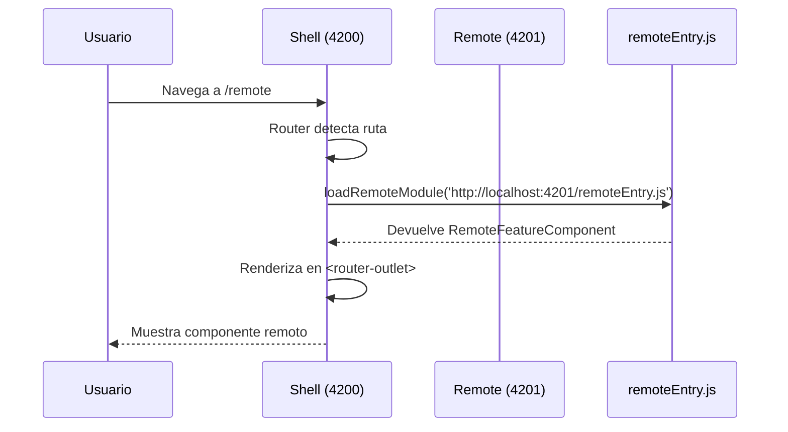

## 37 — Microfrontends con Module Federation

Implementación REAL de microfrontends en Angular usando `@angular-architects/module-federation` con Webpack 5. Shell (host) que carga componentes de una Remote App en tiempo de ejecución.

> **Propósito:** Aprender a implementar microfrontends con Module Federation real: host que orquesta remotos, carga dinámica de componentes, y comunicación cross-app via `window.postMessage`.
>
> **Problema que resuelve:** Las SPAs monolíticas crecen hasta ser imposibles de mantener por un solo equipo; el despliegue requiere coordinar a todos los equipos simultáneamente.
>
> **Cómo lo resuelve:** Module Federation (Webpack 5) permite cargar componentes Angular de aplicaciones independientes en tiempo de ejecución (`loadRemoteModule`), cada una con su propio deploy y puerto, y un shell las coordina.
>
> **Por qué aprenderlo:** Microfrontends son la evolución natural de microservicios al frontend; permiten escalar equipos independientemente y desplegar sin coordinar releases.


```mermaid
flowchart TB
    SHELL["Shell / Host\nlocalhost:4200"] -->|"loadRemoteModule\n(dinámico)"| REMOTE["Remote App\nlocalhost:4201"]
    REMOTE -->|"exponen"| RF["RemoteFeatureComponent"]
    RF -->|"se carga en"| ROUTER["Router Outlet\n del Shell"]
    STYLE SHELL fill:#1a1a2e,color:#fff
    STYLE REMOTE fill:#16213e,color:#fff
    STYLE RF fill:#e94560,color:#fff
```

### Conceptos Clave

- **Module Federation**: `@angular-architects/module-federation` — permite que múltiples apps Angular compilan de forma independiente pero comparten dependencias en runtime
- **Host (Shell)**: aplicación contenedora que carga remotos via `loadRemoteModule`
- **Remote**: aplicación que expone componentes/modulos via `remoteEntry.js`
- **`loadRemoteModule`**: función que descarga un módulo expuesto por un remote en tiempo de ejecución
- **`remoteEntry.js`**: archivo generado por el remote que contiene los módulos expuestos
- **`exposes`**: configuración en el remote que define qué módulos/componenets están disponibles
- **`remotes`**: configuración en el host que define desde dónde cargar los remotos
- **`shared`**: dependencias compartidas (Angular, RxJS) para evitar duplicación
- **Comunicación cross-app**: `window.postMessage` para comunicación entre apps en puertos diferentes
- **Despliegue independiente**: cada app tiene su propio build y servidor de desarrollo

### Cómo funciona Module Federation



### Ejercicios

1. Ejecuta `npm run start:mfe` y navega entre Home y Remote
2. Abre DevTools > Network y observa cómo se descarga `remoteEntry.js`
3. Modifica el `RemoteFeatureComponent` en el remote y recarga el shell (sin recargar el remote)
4. Implementa comunicación bidireccional: que el Shell envíe un evento al Remote
5. Agrega un segundo remote (`admin-app`) en el puerto 4202

### Cómo ejecutar

```bash
cd 37-microfrontends
npm install

# Ejecutar ambas apps en paralelo
npm run start:mfe

# O por separado:
# Terminal 1 - Shell (Host):
npm run start:shell

# Terminal 2 - Remote:
npm run start:remote
```

- Shell App: http://localhost:4200
- Remote App: http://localhost:4201

### Archivos del Proyecto

| Archivo | App | Propósito |
|---------|-----|-----------|
| `README.md` | Raíz | Documentación del proyecto |
| `angular.json` | Raíz | Configuración con builders Module Federation |
| `package.json` | Raíz | Dependencias y scripts (concurrently, webpack) |
| `tsconfig.json` | Raíz | Configuración base de TypeScript con rootDir |
| `projects/shell-app/src/main.ts` | `shell-app` | Punto de entrada del shell |
| `projects/shell-app/src/app/app.ts` | `shell-app` | Componente raíz con RouterOutlet |
| `projects/shell-app/src/app/app.config.ts` | `shell-app` | Configuración con provideRouter |
| `projects/shell-app/src/app/app.routes.ts` | `shell-app` | Rutas con loadRemoteModule |
| `projects/shell-app/src/app/home/home.component.ts` | `shell-app` | Componente Home del shell |
| `projects/shell-app/webpack.mf.config.js` | `shell-app` | Configuración Module Federation (host) |
| `projects/remote-app/src/main.ts` | `remote-app` | Punto de entrada del remote |
| `projects/remote-app/src/app/app.ts` | `remote-app` | Componente raíz standalone |
| `projects/remote-app/src/app/app.config.ts` | `remote-app` | Configuración del remote |
| `projects/remote-app/src/app/remote-feature.ts` | `remote-app` | Componente exportado via Module Federation |
| `projects/remote-app/webpack.mf.config.js` | `remote-app` | Configuración Module Federation (remote) |
