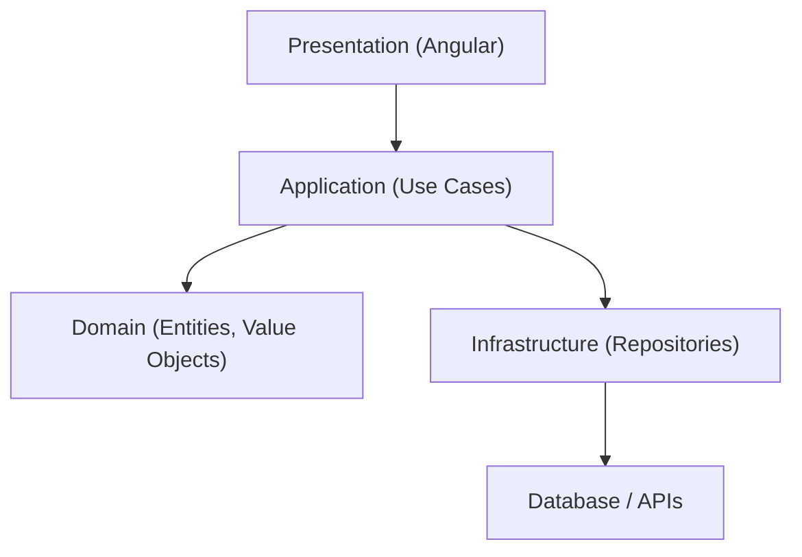

## 38 — Domain-Driven Design (DDD)

Domain-Driven Design aplicado a Angular: Value Objects, Entities, Aggregates, Repositories, y Lenguaje Ubicuo.

> **Propósito:** Aplicar Domain-Driven Design en Angular: Value Objects inmutables, Entities con identidad, Aggregate Roots con invariantes, Domain Events y lenguaje ubicuo.
>
> **Problema que resuelve:** El código sin DDD mezcla lógica de negocio con infraestructura, pierde el vocabulario del dominio y las reglas de negocio están dispersas e inconsistentes.
>
> **Cómo lo resuelve:** Value Objects inmutables (Email, Money) con validación propia, Entities con identidad única, Aggregates que mantienen invariantes, y Domain Events para efectos secundarios.
>
> **Por qué aprenderlo:** DDD es el approach más efectivo para modelar dominios complejos; usado por equipos que necesitan que el código refleje fielmente las reglas del negocio.




### Conceptos Clave

- **Value Objects**: inmutables, sin identidad (`Email`, `Money`, `Address`)
- **Entities**: con identidad (`User`, `Order`, `Product`)
- **Aggregates**: grupo de objetos de dominio tratados como unidad (`Order` con items)
- **Aggregate Root**: raíz del aggregate, única entrada de modificación
- **Repository**: patrón para persistencia, interfaces en dominio
- **Domain Events**: eventos que ocurren en el dominio
- **Lenguaje Ubicuo**: términos compartidos entre negocio y código
- **Capa de dominio**: sin dependencias de Angular, puro TypeScript
- **Servicios de dominio**: lógica de negocio que no encaja en VO/Entity

### Proyecto

Sistema de pedidos DDD: Value Objects (Money, Email, Address), Entities (User, Product, Order), Aggregate (Order con validaciones invariantes).

### Ejercicios

1. Implementa `Email` como Value Object con validación
2. Implementa `Money` como VO inmutable con operaciones
3. Crea `Order` como Aggregate Root con invariantes
4. Define repositorio como interfaz en dominio
5. Implementa adaptador de repositorio en infraestructura

### Cómo ejecutar

```bash
cd 38-ddd
npm install
ng serve --host 0.0.0.0 --port 8080
```

### Archivos del Proyecto

| Archivo | Capa | Propósito |
|---------|------|-----------|
| `README.md` | Raíz | Documentación del proyecto |
| `angular.json` | Raíz | Configuración del workspace Angular |
| `package.json` | Raíz | Dependencias y scripts del proyecto |
| `tsconfig.json` | Raíz | Configuración base de TypeScript |
| `tsconfig.app.json` | Raíz | Configuración de TypeScript para la app |
| `package-lock.json` | Raíz | Bloqueo de versiones de dependencias |
| `src/index.html` | `src/` | HTML principal de la aplicación |
| `src/main.ts` | `src/` | Punto de entrada de la aplicación |
| `src/styles.css` | `src/` | Estilos globales |
| `src/app/app.config.ts` | `src/app/` | Configuración de providers de Angular |
| `src/app/app.ts` | `src/app/` | Componente raíz de la aplicación |
| `src/app/app.css` | `src/app/` | Estilos del componente raíz |
| `src/app/app.html` | `src/app/` | Template del componente raíz |
| `src/app/domain/entities/order.ts` | `domain/entities` | Entidad Order (Aggregate Root) |
| `src/app/domain/entities/product.ts` | `domain/entities` | Entidad Product |
| `src/app/domain/entities/user.ts` | `domain/entities` | Entidad User |
| `src/app/domain/events/domain-event.ts` | `domain/events` | Interfaz base para eventos de dominio |
| `src/app/domain/events/order-placed-event.ts` | `domain/events` | Evento de dominio OrderPlaced |
| `src/app/domain/repositories/order-repository.ts` | `domain/repositories` | Puerto del repositorio de pedidos |
| `src/app/domain/repositories/product-repository.ts` | `domain/repositories` | Puerto del repositorio de productos |
| `src/app/domain/repositories/user-repository.ts` | `domain/repositories` | Puerto del repositorio de usuarios |
| `src/app/domain/repositories/in-memory-order-repository.ts` | `domain/repositories` | Implementación en memoria del repositorio de pedidos |
| `src/app/domain/value-objects/address.ts` | `domain/value-objects` | Value Object Address |
| `src/app/domain/value-objects/email.ts` | `domain/value-objects` | Value Object Email con validación |
| `src/app/domain/value-objects/money.ts` | `domain/value-objects` | Value Object Money con operaciones |
