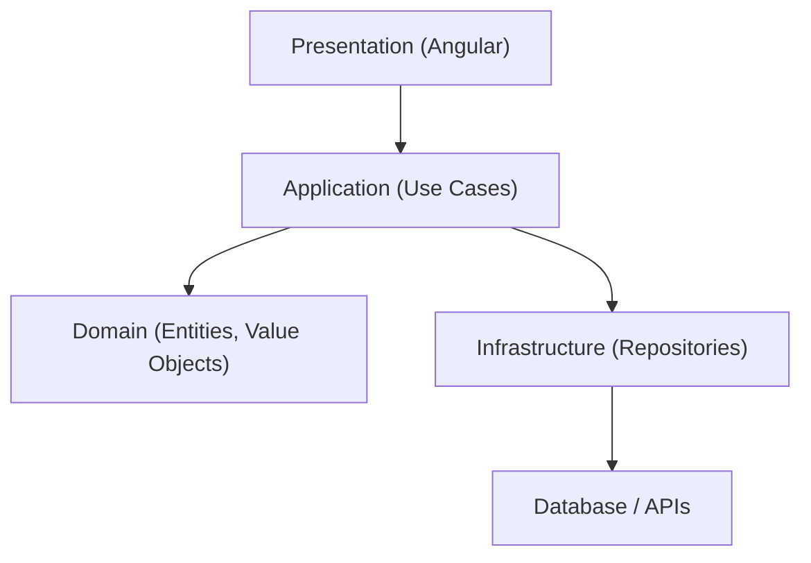

## 38 — Domain-Driven Design (DDD)

Domain-Driven Design aplicado a Angular: Value Objects, Entities, Aggregates, Repositories, y Lenguaje Ubicuo.

> **Propósito:** Aplicar Domain-Driven Design en Angular: Value Objects inmutables, Entities con identidad, Aggregate Roots con invariantes, Domain Events y lenguaje ubicuo.
>
> **Problema que resuelve:** El código sin DDD mezcla lógica de negocio con infraestructura, pierde el vocabulario del dominio y las reglas de negocio están dispersas e inconsistentes.
>
> **Cómo lo resuelve:** Value Objects inmutables (Email, Money) con validación propia, Entities con identidad única, Aggregates que mantienen invariantes, y Domain Events para efectos secundarios.
>
> **Por qué aprenderlo:** DDD es el approach más efectivo para modelar dominios complejos; usado por equipos que necesitan que el código refleje fielmente las reglas del negocio.




### Conceptos Clave

- **Value Objects**: inmutables, sin identidad (`Email`, `Money`, `Address`)
- **Entities**: con identidad (`User`, `Order`, `Product`)
- **Aggregates**: grupo de objetos de dominio tratados como unidad (`Order` con items)
- **Aggregate Root**: raíz del aggregate, única entrada de modificación
- **Repository**: patrón para persistencia, interfaces en dominio
- **Domain Events**: eventos que ocurren en el dominio
- **Lenguaje Ubicuo**: términos compartidos entre negocio y código
- **Capa de dominio**: sin dependencias de Angular, puro TypeScript
- **Servicios de dominio**: lógica de negocio que no encaja en VO/Entity

### Proyecto

Sistema de pedidos DDD: Value Objects (Money, Email, Address), Entities (User, Product, Order), Aggregate (Order con validaciones invariantes).

### Ejercicios

1. Implementa `Email` como Value Object con validación
2. Implementa `Money` como VO inmutable con operaciones
3. Crea `Order` como Aggregate Root con invariantes
4. Define repositorio como interfaz en dominio
5. Implementa adaptador de repositorio en infraestructura

### Cómo ejecutar

```bash
cd 38-ddd
npm install
ng serve
```
