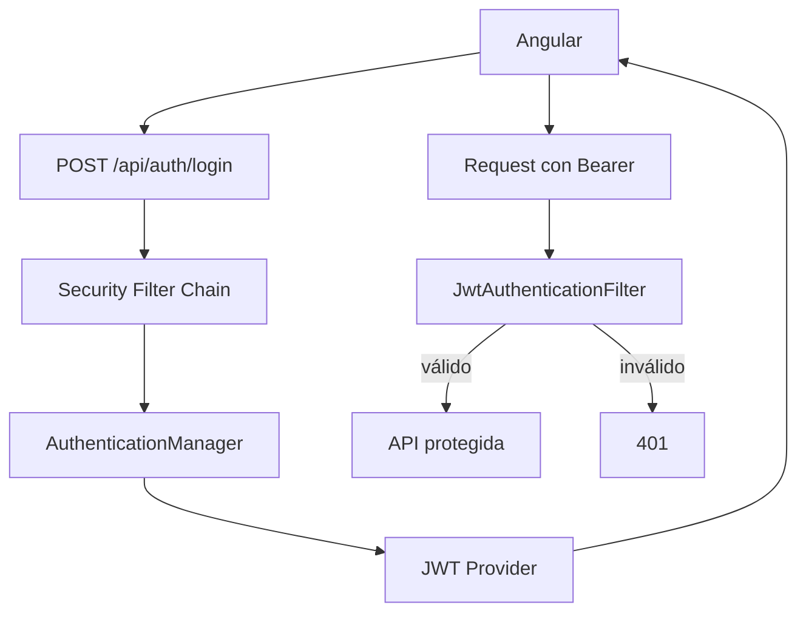

## 39 ÔÇö Spring Boot 4.1.0 + JWT + Angular

Backend empresarial con Spring Boot 4.1.0 y JWT. Dos modos: Angular servido desde Spring y frontend separado.

> **Prop├│sito:** Construir un backend REST completo con Spring Boot 4.1.0 + JWT + Angular: seguridad, roles, refresh tokens y despliegue Docker multi-servicio.
>
> **Problema que resuelve:** Angular necesita un backend real con autenticaci├│n; sin una API JWT funcional, las apps frontend no pueden demostrar integraci├│n completa cliente-servidor.
>
> **C├│mo lo resuelve:** Spring Security con JWT filter, access + refresh tokens, roles (ROLE_ADMIN/ROLE_USER), CORS configurado, Docker Compose con PostgreSQL.
>
> **Por qu├® aprenderlo:** Java/Spring Boot es el backend m├ís usado en empresas; tener Angular + Spring Boot integrados con JWT cubre el stack enterprise m├ís com├║n del mercado.




### Conceptos Clave

- **Spring Boot 4.1.0**: REST API, Spring Security, JWT
- **JWT**: access token (15min) + refresh token (7d)
- **Spring Security**: `SecurityFilterChain`, JwtAuthFilter, `UserDetailsService`
- **Roles y autoridades**: `ROLE_ADMIN`, `ROLE_USER`, hasAuthority
- **RS256 vs HS256**: firma asim├®trica vs sim├®trica
- **Modo integrado**: Angular build en `src/main/resources/static`
- **Modo separado**: Angular en puerto 4200, Spring Boot en 8080, CORS configurado
- **Docker**: Dockerfile multi-stage, docker-compose Angular + Spring Boot + PostgreSQL
- **OpenAPI**: `springdoc-openapi` para documentaci├│n de API

### Proyecto

API REST con Spring Boot 4.1.0 + JWT + Angular. Ambos modos de despliegue: integrado y separado.

### Ejercicios

1. Configura Spring Security con JWT filter
2. Implementa login/refresh/register endpoints
3. Conecta Angular con interceptor JWT
4. Configura CORS para frontend separado
5. Despliega con Docker Compose (Angular + Spring Boot + PostgreSQL)

### C├│mo ejecutar

```bash
cd 39-springboot-jwt
# Modo separado: backend + frontend
docker compose up
```

### Archivos del Proyecto

| Archivo | Stack | Propósito |
|---------|-------|-----------|
| `README.md` | Raíz | Documentación del proyecto |
| `angular.json` | Frontend | Configuración del workspace Angular |
| `package.json` | Frontend | Dependencias y scripts del frontend |
| `tsconfig.json` | Frontend | Configuración base de TypeScript |
| `tsconfig.app.json` | Frontend | Configuración de TypeScript para la app |
| `package-lock.json` | Frontend | Bloqueo de versiones de dependencias |
| `proxy.conf.json` | Frontend | Configuración de proxy para desarrollo |
| `src/index.html` | Frontend | HTML principal de la aplicación |
| `src/main.ts` | Frontend | Punto de entrada de la aplicación |
| `src/styles.css` | Frontend | Estilos globales |
| `src/app/app.config.ts` | Frontend | Configuración de providers de Angular |
| `src/app/app.component.ts` | Frontend | Componente raíz de la aplicación |
| `src/app/app.routes.ts` | Frontend | Configuración de rutas |
| `src/app/auth.service.ts` | Frontend | Servicio de autenticación JWT |
| `src/app/jwt.interceptor.ts` | Frontend | Interceptor HTTP que adjunta token JWT |
| `backend/pom.xml` | Backend | Configuración Maven de Spring Boot |
| `backend/src/main/resources/application.properties` | Backend | Configuración de Spring Boot |
| `backend/src/main/java/com/example/SpringbootJwtApplication.java` | Backend | Clase principal de Spring Boot |
| `backend/src/main/java/com/example/AuthController.java` | Backend | Controlador de autenticación (login/register) |
| `backend/src/main/java/com/example/JwtAuthFilter.java` | Backend | Filtro de seguridad JWT |
| `backend/src/main/java/com/example/JwtUtil.java` | Backend | Utilidad para generar/validar JWT |
| `backend/src/main/java/com/example/SecurityConfig.java` | Backend | Configuración de Spring Security |
| `backend/src/main/java/com/example/User.java` | Backend | Entidad User JPA |
| `backend/src/main/java/com/example/UserDetailsServiceImpl.java` | Backend | Implementación de UserDetailsService |
| `backend/src/main/java/com/example/UserRepository.java` | Backend | Repositorio JPA de usuarios |
