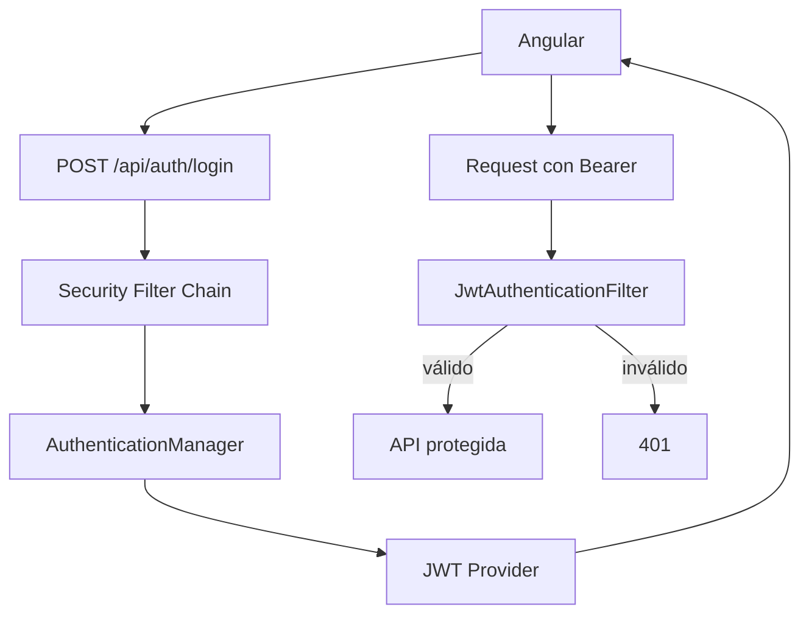

## 39 ÔÇö Spring Boot 4.1.0 + JWT + Angular

Backend empresarial con Spring Boot 4.1.0 y JWT. Dos modos: Angular servido desde Spring y frontend separado.

> **Prop├│sito:** Construir un backend REST completo con Spring Boot 4.1.0 + JWT + Angular: seguridad, roles, refresh tokens y despliegue Docker multi-servicio.
>
> **Problema que resuelve:** Angular necesita un backend real con autenticaci├│n; sin una API JWT funcional, las apps frontend no pueden demostrar integraci├│n completa cliente-servidor.
>
> **C├│mo lo resuelve:** Spring Security con JWT filter, access + refresh tokens, roles (ROLE_ADMIN/ROLE_USER), CORS configurado, Docker Compose con PostgreSQL.
>
> **Por qu├® aprenderlo:** Java/Spring Boot es el backend m├ís usado en empresas; tener Angular + Spring Boot integrados con JWT cubre el stack enterprise m├ís com├║n del mercado.




### Conceptos Clave

- **Spring Boot 4.1.0**: REST API, Spring Security, JWT
- **JWT**: access token (15min) + refresh token (7d)
- **Spring Security**: `SecurityFilterChain`, JwtAuthFilter, `UserDetailsService`
- **Roles y autoridades**: `ROLE_ADMIN`, `ROLE_USER`, hasAuthority
- **RS256 vs HS256**: firma asim├®trica vs sim├®trica
- **Modo integrado**: Angular build en `src/main/resources/static`
- **Modo separado**: Angular en puerto 4200, Spring Boot en 8080, CORS configurado
- **Docker**: Dockerfile multi-stage, docker-compose Angular + Spring Boot + PostgreSQL
- **OpenAPI**: `springdoc-openapi` para documentaci├│n de API

### Proyecto

API REST con Spring Boot 4.1.0 + JWT + Angular. Ambos modos de despliegue: integrado y separado.

### Ejercicios

1. Configura Spring Security con JWT filter
2. Implementa login/refresh/register endpoints
3. Conecta Angular con interceptor JWT
4. Configura CORS para frontend separado
5. Despliega con Docker Compose (Angular + Spring Boot + PostgreSQL)

### C├│mo ejecutar

```bash
cd 39-springboot-jwt
# Modo separado: backend + frontend
docker compose up
```
