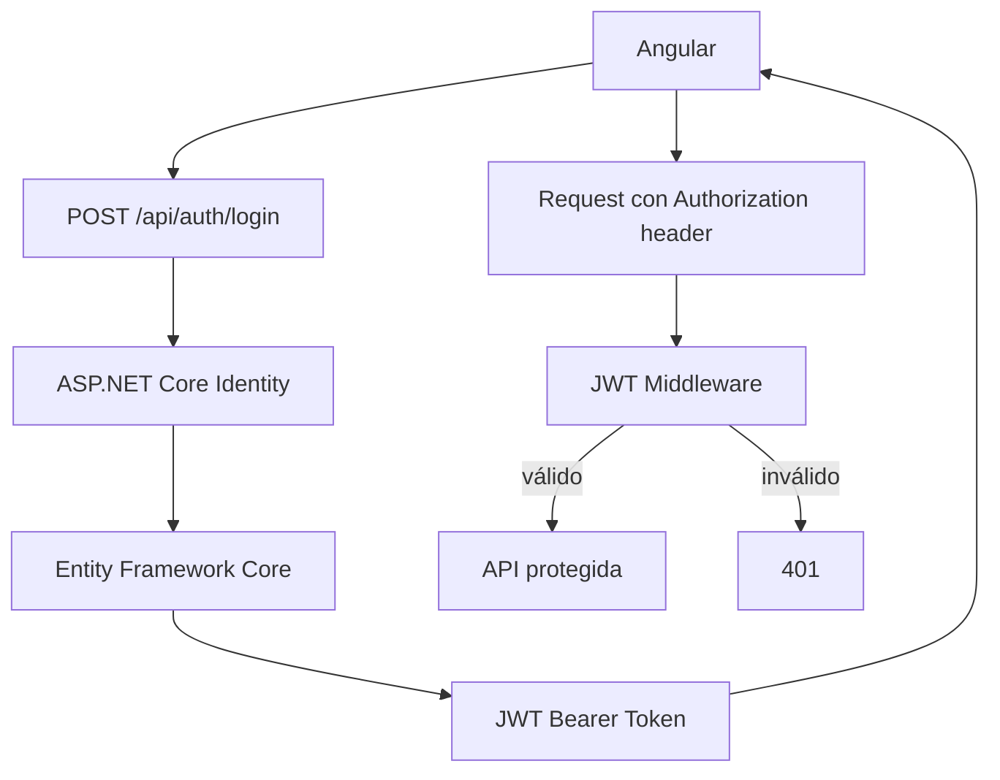

## 40 ÔÇö .NET 10 + JWT + Angular

Backend empresarial con .NET 10 y JWT. Dos modos: Angular servido desde .NET y frontend separado.

> **Prop├│sito:** Construir un backend enterprise con .NET 10 + JWT + Angular: ASP.NET Core Identity, JWT bearer, Entity Framework y Docker.
>
> **Problema que resuelve:** .NET es el backend estándar en grandes corporaciones; sin ejemplos de integración JWT con Angular, los equipos .NET carecen de referencia actualizada.
>
> **C├│mo lo resuelve:** ASP.NET Core con JWT bearer authentication, Identity para gesti├│n de usuarios, Entity Framework para base de datos, y Docker Compose para despliegue.
>
> **Por qu├® aprenderlo:** .NET + Angular es el stack enterprise por excelencia en el mundo Windows/ Azure; dominar esta integraci├│n abre puertas en consultoras y grandes empresas.




### Conceptos Clave

- **.NET 10**: Minimal APIs, `MapGroup`, `TypedResults`
- **JWT**: `Microsoft.AspNetCore.Authentication.JwtBearer`
- **Identity**: `Microsoft.AspNetCore.Identity`, roles, claims
- **Políticas**: `AddPolicy`, `RequireRole`, `RequireClaim`
- **Refresh tokens**: `RefreshToken` entity, rotaci├│n, revocaci├│n
- **Modo integrado**: Angular build en `wwwroot/`, `UseStaticFiles()`, `UseSpa()`
- **Modo separado**: .NET API + Angular con CORS
- **Entity Framework Core**: migrations, SQL Server / PostgreSQL
- **Docker**: Dockerfile multi-stage, docker-compose .NET + Angular + SQL Server

### Proyecto

API REST con .NET 10 + JWT + Angular. Ambos modos de despliegue: integrado y separado.

### Ejercicios

1. Configura JWT Bearer authentication en .NET 10
2. Implementa endpoints login/refresh/register con Minimal APIs
3. Conecta Angular con interceptor JWT
4. Integra Angular en .NET con StaticFiles + SPA
5. Despliega con Docker Compose (.NET + Angular + SQL Server)

### C├│mo ejecutar

```bash
cd 40-dotnet-jwt
# Modo separado: backend + frontend
docker compose up
```
