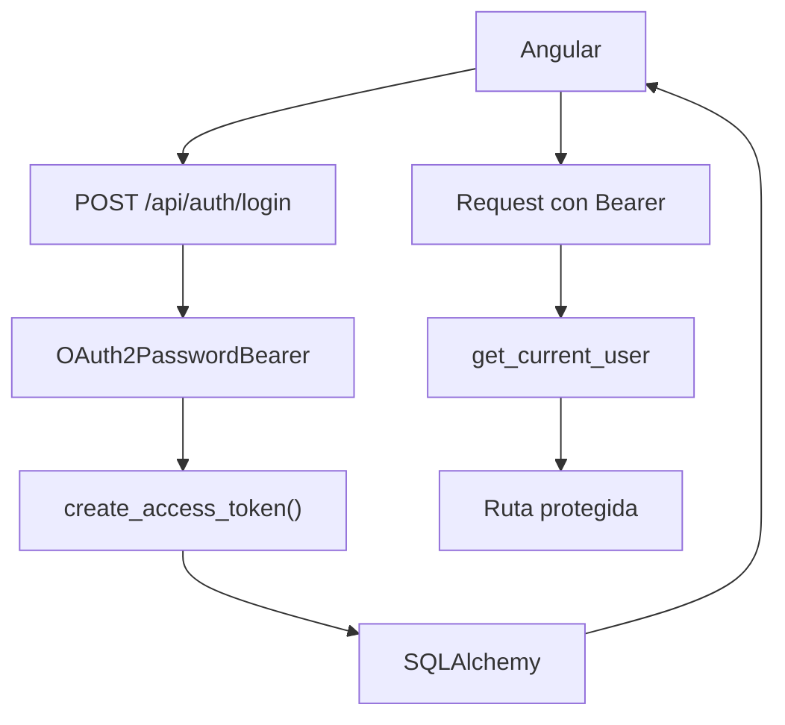

## 40 ÔÇö FastAPI + JWT + Angular

Backend empresarial con Python FastAPI y JWT. Dos modos: Angular servido desde FastAPI y frontend/backend separados.

> **Prop├│sito:** Construir un backend moderno con FastAPI + JWT + Angular: async Python, OAuth2 password flow, SQLAlchemy y despliegue Docker.
>
> **Problema que resuelve:** Python/FastAPI es una alternativa creciente a Java/Spring para backends; sin ejemplos de integraci├│n con Angular JWT, los teams Python no tienen referencia.
>
> **C├│mo lo resuelve:** FastAPI con OAuth2PasswordBearer, JWT access/refresh tokens, SQLAlchemy async para base de datos, y Docker Compose para despliegue integrado con Angular.
>
> **Por qu├® aprenderlo:** FastAPI es el framework Python m├ís r├ípido para APIs; su integraci├│n con Angular JWT es directa y moderna, ideal para startups y equipos Python.




### Conceptos Clave

- **FastAPI**: async Python, Pydantic models, `FastAPI()`, `APIRouter`
- **JWT**: `python-jose` para JWT, `passlib` + `bcrypt` para hashing
- **Auth endpoints**: `/auth/login`, `/auth/refresh`, `/auth/register`
- **Dependencias FastAPI**: `Depends`, `OAuth2PasswordBearer`, `get_current_user`
- **SQLAlchemy + Alembic**: modelos ORM, migraciones, seed
- **Modo integrado**: FastAPI sirve Angular con `StaticFiles` + `mount`
- **Modo separado**: FastAPI en puerto 8000, Angular en 4200, CORS configurado
- **Async SQLAlchemy**: `AsyncSession`, conexiones asíncronas
- **Docker**: Dockerfile multi-stage, docker-compose FastAPI + Angular + PostgreSQL

### Proyecto

API REST con FastAPI + JWT + Angular. Ambos modos de despliegue: integrado (FastAPI sirve Angular) y separado con CORS.

### Ejercicios

1. Configura FastAPI con auth JWT (access + refresh)
2. Implementa dependencias `get_current_user` con roles
3. Conecta Angular con interceptor JWT contra FastAPI
4. Configura FastAPI para servir Angular build con StaticFiles
5. Despliega con Docker Compose (FastAPI + Angular + PostgreSQL)

### C├│mo ejecutar

```bash
cd 40-fastapi-jwt
docker compose up
```

### Archivos del Proyecto

| Archivo | Stack | Propósito |
|---------|-------|-----------|
| `README.md` | Raíz | Documentación del proyecto |
| `angular.json` | Frontend | Configuración del workspace Angular |
| `package.json` | Frontend | Dependencias y scripts del frontend |
| `tsconfig.json` | Frontend | Configuración base de TypeScript |
| `tsconfig.app.json` | Frontend | Configuración de TypeScript para la app |
| `package-lock.json` | Frontend | Bloqueo de versiones de dependencias |
| `proxy.conf.json` | Frontend | Configuración de proxy para desarrollo |
| `src/index.html` | Frontend | HTML principal de la aplicación |
| `src/main.ts` | Frontend | Punto de entrada de la aplicación |
| `src/styles.css` | Frontend | Estilos globales |
| `src/app/app.config.ts` | Frontend | Configuración de providers de Angular |
| `src/app/app.component.ts` | Frontend | Componente raíz de la aplicación |
| `src/app/app.routes.ts` | Frontend | Configuración de rutas |
| `src/app/auth.service.ts` | Frontend | Servicio de autenticación JWT |
| `src/app/jwt.interceptor.ts` | Frontend | Interceptor HTTP que adjunta token JWT |
| `backend/main.py` | Backend | Punto de entrada de la API FastAPI |
| `backend/auth.py` | Backend | Lógica de autenticación JWT |
| `backend/database.py` | Backend | Configuración de base de datos SQLAlchemy |
| `backend/models.py` | Backend | Modelos ORM con SQLAlchemy |
| `backend/requirements.txt` | Backend | Dependencias Python del backend |
