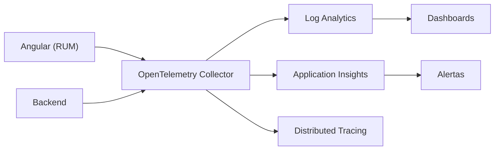

## 41 ÔÇö Observabilidad (Observability)

Monitoreo y observabilidad en Angular: Sentry, OpenTelemetry, Web Vitals, logs estructurados y trazabilidad.

> **Prop├│sito:** Implementar observabilidad completa en Angular: Sentry para errores, OpenTelemetry para trazas, Web Vitals para m├®tricas reales de usuario y logging estructurado.
>
> **Problema que resuelve:** Sin observabilidad, los errores en producción son invisibles, no sabes cómo rinden tus páginas para usuarios reales y debugging es como buscar una aguja en un pajar.
>
> **C├│mo lo resuelve:** Sentry captura errores con stack traces y contexto, OpenTelemetry traza peticiones completas frontendÔåÆbackend, Web Vitals mide LCP/CLS/INP reales, y ErrorHandler personalizado captura errores globales.
>
> **Por qu├® aprenderlo:** La observabilidad distingue equipos profesionales de aficionados; sin ella no puedes mejorar lo que no mides y los errores en producci├│n te son desconocidos.




### Conceptos Clave

- **Sentry**: `@sentry/angular`, `TraceService`, capture exceptions, performance
- **OpenTelemetry**: `@opentelemetry/instrumentation-angular`, trazas distribuidas
- **Web Vitals**: `web-vitals` library, LCP, FID, CLS, INP
- **Error handling global**: `ErrorHandler` personalizado, `HttpErrorResponse`
- **Logging**: `Logger` service con niveles (debug, info, warn, error)
- **Correlation ID**: `HttpContext` token para trazar peticiones
- **Trazas distribuidas**: OpenTelemetry + backend (Spring Boot/.NET/FastAPI)
- **RUM (Real User Monitoring)**: m├®tricas reales de usuario
- **Dashboard**: monitoreo centralizado en Sentry/Grafana

### Proyecto

Configuraci├│n completa de observabilidad: Sentry + Web Vitals + OpenTelemetry + ErrorHandler personalizado en Angular.

### Ejercicios

1. Integra Sentry con `@sentry/angular`
2. Captura errores globales con `ErrorHandler`
3. Mide Core Web Vitals (LCP, CLS, INP)
4. Configura OpenTelemetry tracing
5. Implementa Correlation ID en interceptores HTTP

### C├│mo ejecutar

```bash
cd 41-observability
npm install
ng serve --host 0.0.0.0 --port 8080
```

### Archivos del Proyecto

| Archivo | Carpeta | Propósito |
|---------|---------|-----------|
| `README.md` | Raíz | Documentación del proyecto |
| `angular.json` | Raíz | Configuración del workspace Angular |
| `package.json` | Raíz | Dependencias y scripts del proyecto |
| `tsconfig.json` | Raíz | Configuración base de TypeScript |
| `tsconfig.app.json` | Raíz | Configuración de TypeScript para la app |
| `package-lock.json` | Raíz | Bloqueo de versiones de dependencias |
| `src/index.html` | `src/` | HTML principal de la aplicación |
| `src/main.ts` | `src/` | Punto de entrada de la aplicación |
| `src/styles.css` | `src/` | Estilos globales |
| `src/app/app.config.ts` | `src/app/` | Configuración de providers de Angular |
| `src/app/app.ts` | `src/app/` | Componente raíz de la aplicación |
| `src/app/app.css` | `src/app/` | Estilos del componente raíz |
| `src/app/app.html` | `src/app/` | Template del componente raíz |
| `src/app/logger.service.ts` | `src/app/` | Servicio de logging estructurado |
| `src/app/error-handler.ts` | `src/app/` | ErrorHandler global personalizado |
| `src/app/http-log.interceptor.ts` | `src/app/` | Interceptor HTTP para logging de peticiones |
| `src/app/web-vitals.service.ts` | `src/app/` | Servicio de medición de Web Vitals |
