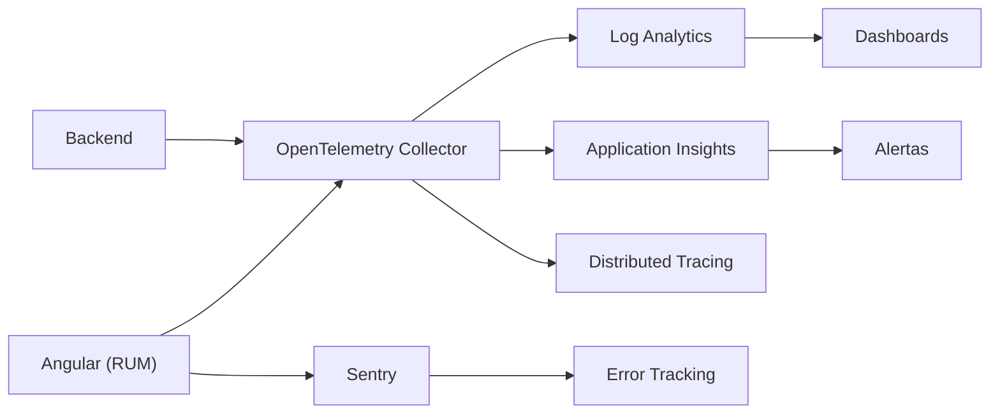

## 41 — Observabilidad (Observability)

Monitoreo y observabilidad en Angular: Sentry, OpenTelemetry, Web Vitals, logs estructurados y trazabilidad.

> **Propósito:** Implementar observabilidad completa en Angular: Sentry para errores, OpenTelemetry para trazas, Web Vitals para métricas reales de usuario y logging estructurado.
>
> **Problema que resuelve:** Sin observabilidad, los errores en producción son invisibles, no sabes cómo rinden tus páginas para usuarios reales y debugging es como buscar una aguja en un pajar.
>
> **Cómo lo resuelve:** Sentry captura errores con stack traces y contexto, OpenTelemetry traza peticiones completas frontend→backend, Web Vitals mide LCP/CLS/INP reales, y ErrorHandler personalizado captura errores globales.
>
> **Por qué aprenderlo:** La observabilidad distingue equipos profesionales de aficionados; sin ella no puedes mejorar lo que no mides y los errores en producción te son desconocidos.




### Conceptos Clave

- **Sentry**: `@sentry/angular`, captura errores con stack traces y contexto del navegador
- **OpenTelemetry**: Estándar abierto para trazas distribuidas, métricas y logs
- **Traces y Spans**: Un trace es una operación completa; un span es un segmento dentro de ella
- **Web Vitals**: `web-vitals` library, LCP, FID, CLS — métricas reales de usuario
- **Error handling global**: `ErrorHandler` personalizado para capturar errores no atrapados
- **Logging**: `LoggerService` con niveles (debug, info, warn, error)
- **Correlation ID**: Identificador único para rastrear peticiones HTTP de extremo a extremo
- **Interceptores HTTP**: Funciones que instrumentan cada petición HTTP automáticamente
- **Trazas distribuidas**: OpenTelemetry + backend (Spring Boot/.NET/FastAPI)
- **RUM (Real User Monitoring)**: Métricas reales de usuario en producción
- **Dashboard**: Monitoreo centralizado en Sentry/Grafana/Tempo

### Conceptos de OpenTelemetry

#### ¿Qué es OpenTelemetry?

OpenTelemetry (OTel) es un proyecto de código abierto que estandariza cómo las aplicaciones reportan telemetría (trazas, métricas y logs). En lugar de usar herramientas proprietary, OTel te da un API única que funciona con cualquier backend: Jaeger, Zipkin, Grafana Tempo, Azure Monitor, Datadog, etc.

**Analogía:** Piensa en OTel como el enchufe eléctrico estándar. Antes de que existiera un estándar, cada país tenía su propio tipo de enchufe. Con OTel, puedes "enchufar" tu aplicación a cualquier herramienta de monitoreo sin cambiar el código.

#### Traces, Spans y el modelo de datos

```
Trace (viaje completo del paquete de Amazon)
├── Span: HTTP GET /api/products (duración: 150ms)
│   ├── Atributo: http.method = "GET"
│   ├── Atributo: http.url = "https://api.example.com/products"
│   └── Atributo: http.status_code = 200
├── Span: POST /api/orders (duración: 300ms)
│   ├── Atributo: http.method = "POST"
│   └── Atributo: http.status_code = 201
└── Span: GET /api/users (duración: 80ms)
    └── Atributo: http.status_code = 200
```

**Analogía del GPS:** Un trace es el viaje completo de tu auto. Cada span es una parada: "salí de casa", "llegué al semáforo", "entré a la autopista", "llegué al destino". El GPS te muestra el recorrido completo (trace) y cada segmento (span) con su duración.

#### Configuración del WebTracerProvider

```typescript
// tracing.ts
import { WebTracerProvider } from '@opentelemetry/sdk-trace-web';
import { SimpleSpanProcessor, ConsoleSpanExporter } from '@opentelemetry/sdk-trace-base';
import { Resource } from '@opentelemetry/resources';
import { ATTR_SERVICE_NAME } from '@opentelemetry/semantic-conventions';

const provider = new WebTracerProvider({
  resource: new Resource({
    [ATTR_SERVICE_NAME]: 'angular-observability-demo',
  }),
});

// En desarrollo: ConsoleSpanExporter imprime trazas en la consola
provider.addSpanProcessor(new SimpleSpanProcessor(new ConsoleSpanExporter()));

// En producción: BatchSpanProcessor + OTLPTraceExporter
// import { BatchSpanProcessor } from '@opentelemetry/sdk-trace-base';
// import { OTLPTraceExporter } from '@opentelemetry/exporter-trace-otlp-http';
// provider.addSpanProcessor(
//   new BatchSpanProcessor(new OTLPTraceExporter({
//     url: 'https://otel-collector:4318/v1/traces',
//   }))
// );

provider.register();
export const tracer = provider.getTracer('angular-observability-demo');
```

**Analogía:** El WebTracerProvider es como la central de monitoreo de una fábrica. Le dices "vigila la línea de producción" (Resource con service name), le pones cámaras (SpanProcessors) y defines a dónde enviar las grabaciones (Exporters).

#### Interceptor HTTP de OpenTelemetry

```typescript
// otel.interceptor.ts
import { HttpInterceptorFn } from '@angular/common/http';
import { trace, SpanStatusCode } from '@opentelemetry/api';
import { tap, catchError } from 'rxjs/operators';
import { throwError } from 'rxjs';

const tracer = trace.getTracer('angular-observability-demo');

export const otelInterceptor: HttpInterceptorFn = (req, next) => {
  // 1. Crear span al inicio
  const span = tracer.startSpan(`HTTP ${req.method}`, {
    'http.method': req.method,
    'http.url': req.url.toString(),
  });

  // 2. Pasar petición y manejar resultado
  return next(req).pipe(
    tap(() => {
      span.setStatus({ code: SpanStatusCode.OK });
      span.end();
    }),
    catchError((error) => {
      span.setStatus({ code: SpanStatusCode.ERROR, message: error.message });
      span.end();
      return throwError(() => error);
    })
  );
};
```

**Analogía:** Es como un inspector de tráfico que se monta en cada camión. Anota hora de salida, destino, tipo de carga, y si hubo accidentes. Todo se registra en un sistema de seguimiento centralizado.

### Sentry vs OpenTelemetry

| Característica | Sentry | OpenTelemetry |
|---------------|--------|---------------|
| **Enfoque** | Errores y excepciones | Trazas, métricas, logs |
| **Uso principal** | Bug tracking y alertas | Performance monitoring |
| **Costo** | Freemium (gratis hasta cierto límite) | Gratis (open source) |
| **Vendor lock-in** | Sentry (aunque tiene integraciones) | Ninguno (estándar abierto) |
| **Setup** | `Sentry.init({ dsn })` | `WebTracerProvider` + exporters |
| **Ideal para** | Capturar bugs en producción | Medir rendimiento end-to-end |

**¿Cuándo usar cuál?**
- **Sentry**: Cuando necesitas saber qué errores ocurren y por qué
- **OpenTelemetry**: Cuando necesitas medir el rendimiento de peticiones HTTP, tiempos de respuesta y cuellos de botella
- **Ambos**: En producción, usas Sentry para errores Y OpenTelemetry para performance. Son complementarios, no excluyentes.

### Ejercicios

1. Integra Sentry con `@sentry/angular` para capturar errores
2. Configura OpenTelemetry con `WebTracerProvider` y `ConsoleSpanExporter`
3. Crea un interceptor HTTP que instrumente cada petición con spans
4. Mide Core Web Vitals (LCP, CLS, INP) con la librería `web-vitals`
5. Implementa Correlation ID en interceptores HTTP para trazabilidad
6. Exporta trazas a Jaeger o Zipkin (reemplaza ConsoleSpanExporter)
7. Crea un span manual para una operación que no sea HTTP (ej: cálculo de negocio)

### Cómo ejecutar

```bash
cd 41-observability
npm install
ng serve --host 0.0.0.0 --port 8080
```

### Archivos del Proyecto

| Archivo | Carpeta | Propósito |
|---------|---------|-----------|
| `README.md` | Raíz | Documentación del proyecto |
| `angular.json` | Raíz | Configuración del workspace Angular |
| `package.json` | Raíz | Dependencias y scripts del proyecto |
| `tsconfig.json` | Raíz | Configuración base de TypeScript |
| `tsconfig.app.json` | Raíz | Configuración de TypeScript para la app |
| `package-lock.json` | Raíz | Bloqueo de versiones de dependencias |
| `src/index.html` | `src/` | HTML principal de la aplicación |
| `src/main.ts` | `src/` | Punto de entrada de la aplicación |
| `src/styles.css` | `src/` | Estilos globales |
| `src/app/app.config.ts` | `src/app/` | Configuración de providers de Angular |
| `src/app/app.ts` | `src/app/` | Componente raíz de la aplicación |
| `src/app/app.css` | `src/app/` | Estilos del componente raíz |
| `src/app/app.html` | `src/app/` | Template del componente raíz |
| `src/app/tracing.ts` | `src/app/` | Configuración de OpenTelemetry WebTracerProvider |
| `src/app/otel.interceptor.ts` | `src/app/` | Interceptor HTTP que instrumenta peticiones con spans |
| `src/app/logger.service.ts` | `src/app/` | Servicio de logging estructurado |
| `src/app/error-handler.ts` | `src/app/` | ErrorHandler global personalizado |
| `src/app/http-log.interceptor.ts` | `src/app/` | Interceptor HTTP para logging de peticiones |
| `src/app/web-vitals.service.ts` | `src/app/` | Servicio de medición de Web Vitals |
