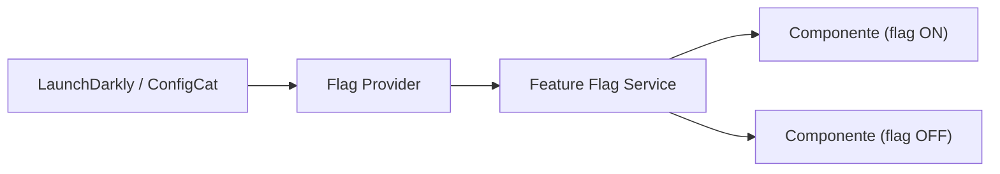

## 42 ÔÇö Feature Flags

Feature flags en Angular: activaci├│n/desactivaci├│n de funcionalidades, releases graduales, A/B testing.

> **Propósito:** Implementar feature flags en Angular: toggles remotos, rollout porcentual, A/B testing, flags tipados y limpieza automática de flags muertos.
>
> **Problema que resuelve:** Desplegar c├│digo incompleto o desactivar funcionalidades en producci├│n sin feature flags requiere deploys de emergencia o c├│digo comentado en el c├│digo base.
>
> **C├│mo lo resuelve:** Feature flags con servicio centralizado que consulta flags remotos (LaunchDarkly/ConfigCat), rollout gradual por porcentaje, A/B testing con asignaci├│n de variantes, y flags tipados con TypeScript.
>
> **Por qu├® aprenderlo:** Feature flags permiten despliegues continuos sin riesgo, pruebas en producci├│n con usuarios reales y release de funcionalidades bajo demanda; est├índar en equipos que practican CI/CD.




### Conceptos Clave

- **Feature Flags**: `signal<boolean>` por feature, control centralizado
- **Proveedores**: flags desde API, Firebase Remote Config, LaunchDarkly
- **Flags basadas en se├▒ales**: `featureFlag('newCheckout')` devuelve se├▒al
- **Directiva estructural**: `*appFeatureFlag` o `@if (flags.newCheckout())`
- **Kill switches**: desactivar features en producci├│n inmediatamente
- **Rollout gradual**: porcentaje de usuarios, targeting por rol/id
- **A/B testing**: flags para experimentaci├│n, analytics
- **Persistencia**: flags en localStorage, override por usuario

### Proyecto

App con 3 feature flags (modo oscuro, checkout nuevo, b├║squeda avanzada) controlados desde API + panel de administraci├│n.

### Ejercicios

1. Crea servicio de feature flags con se├▒ales
2. Implementa directiva `*appFeatureFlag` y control flow
3. Agrega flags desde API con polling cada 5min
4. Implementa rollout gradual por porcentaje
5. Crea panel admin para toggle flags en tiempo real

### C├│mo ejecutar

```bash
cd 42-feature-flags
npm install
ng serve --host 0.0.0.0 --port 8080
```

### Archivos del Proyecto

| Archivo | Carpeta | Propósito |
|---------|---------|-----------|
| `README.md` | Raíz | Documentación del proyecto |
| `angular.json` | Raíz | Configuración del workspace Angular |
| `package.json` | Raíz | Dependencias y scripts del proyecto |
| `tsconfig.json` | Raíz | Configuración base de TypeScript |
| `tsconfig.app.json` | Raíz | Configuración de TypeScript para la app |
| `src/index.html` | `src/` | HTML principal de la aplicación |
| `src/main.ts` | `src/` | Punto de entrada de la aplicación |
| `src/styles.css` | `src/` | Estilos globales |
| `src/app/app.config.ts` | `src/app/` | Configuración de providers de Angular |
| `src/app/app.ts` | `src/app/` | Componente raíz de la aplicación |
| `src/app/app.css` | `src/app/` | Estilos del componente raíz |
| `src/app/app.html` | `src/app/` | Template del componente raíz |
| `src/app/feature-flags.service.ts` | `src/app/` | Servicio centralizado de feature flags |
| `src/app/feature-flag.directive.ts` | `src/app/` | Directiva estructural para toggle de features |
