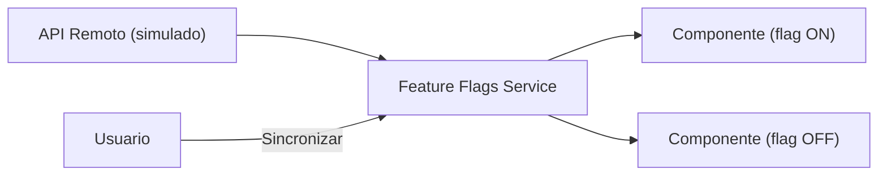

## 42 — Feature Flags

Feature flags en Angular: activación/desactivación de funcionalidades con carga remota simulada.

> **Propósito:** Implementar feature flags en Angular con servicio centralizado que carga flags desde un API remoto (simulado), permite overrides locales y sincronización con el servidor.
>
> **Problema que resuelve:** Desplegar código incompleto o desactivar funcionalidades en producción sin feature flags requiere deploys de emergencia o código comentado en el código base.
>
> **Cómo lo resuelve:** Feature flags con signal<boolean> por feature, servicio centralizado que obtiene flags de un API remoto (simulado con delay de 300ms), override local para toggles, y sincronización manual con el servidor.
>
> **Por qué aprenderlo:** Feature flags permiten despliegues continuos sin riesgo, pruebas en producción con usuarios reales y release de funcionalidades bajo demanda; estándar en equipos que practican CI/CD.



### Conceptos Clave

- **Feature Flags**: `signal<boolean>` por feature, control centralizado
- **Carga remota**: `FeatureFlagsApiService` simula petición HTTP con delay de 300ms
- **Override local**: Toggle manual que se sobreescribe al sincronizar con el servidor
- **Sincronización**: `refreshFlags()` recarga valores desde el API remoto
- **Directivas estructurales**: `*ffShow` y `*ffHide` muestran/ocultan según flag
- **Kill switches**: desactivar features en producción inmediatamente
- **Rollout gradual**: porcentaje de usuarios (preparado para expansión futura)
- **Persistencia**: flags en memoria, override por usuario

### Proyecto

App con 3 feature flags (modo oscuro, checkout nuevo, búsqueda avanzada) controlados desde API simulado + panel de administración con sincronización.

### Ejercicios

1. Crea servicio de feature flags con señales
2. Implementa directiva `*ffShow` y `*ffHide`
3. Agrega flags desde API con delay simulado
4. Implementa persistencia con localStorage para que los flags sobrevivan recargas
5. Crea un interceptor que agregue headers de autenticación a las peticiones de flags

### Cómo ejecutar

```bash
cd 42-feature-flags
npm install
ng serve --host 0.0.0.0 --port 8080
```

### Archivos del Proyecto

| Archivo | Carpeta | Propósito |
|---------|---------|-----------|
| `README.md` | Raíz | Documentación del proyecto |
| `angular.json` | Raíz | Configuración del workspace Angular |
| `package.json` | Raíz | Dependencias y scripts del proyecto |
| `tsconfig.json` | Raíz | Configuración base de TypeScript |
| `tsconfig.app.json` | Raíz | Configuración de TypeScript para la app |
| `src/index.html` | `src/` | HTML principal de la aplicación |
| `src/main.ts` | `src/` | Punto de entrada de la aplicación |
| `src/styles.css` | `src/` | Estilos globales |
| `src/app/app.config.ts` | `src/app/` | Configuración de providers de Angular (incluye provideHttpClient) |
| `src/app/app.ts` | `src/app/` | Componente raíz con panel de toggles y sincronización |
| `src/app/app.css` | `src/app/` | Estilos del componente raíz |
| `src/app/app.html` | `src/app/` | Template con toggle panel y botón sincronizar |
| `src/app/feature-flags.service.ts` | `src/app/` | Servicio centralizado con carga remota y overrides locales |
| `src/app/feature-flags-api.service.ts` | `src/app/` | Servicio API que simula comunicación con backend remoto |
| `src/app/feature-flag.directive.ts` | `src/app/` | Directivas estructurales ffShow y ffHide |
