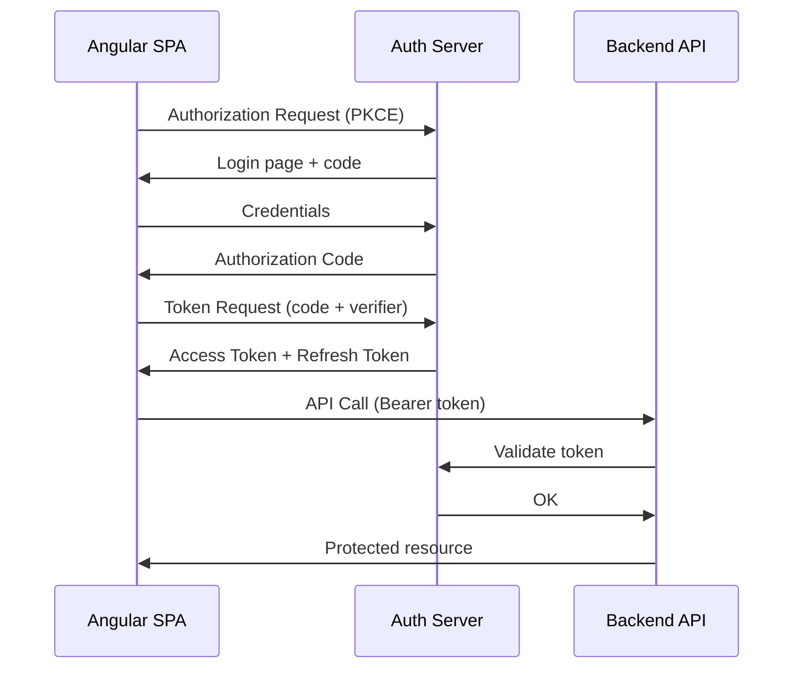

## 43 ÔÇö OAuth 2.0 y Autenticaci├│n Social

OAuth 2.0 en Angular con `angular-oauth2-oidc`, Auth0, y login social (Google, GitHub, Microsoft).

> **Prop├│sito:** Integrar autenticaci├│n OAuth 2.0 / OIDC con Angular usando PKCE flow, refresh tokens y m├║ltiples providers (Google, GitHub, Azure AD).
>
> **Problema que resuelve:** Implementar OAuth manualmente es complejo (PKCE flow, state validation, token exchange) y riesgoso (access token en URL, CSRF).
>
> **Cómo lo resuelve:** OAuth con PKCE (sin client_secret), estado aleatorio para prevenir CSRF, refresh tokens rotativos, y librería angular-auth-oidc-client que maneja el flujo completo con redirects.
>
> **Por qu├® aprenderlo:** OAuth 2.0 + OIDC es el est├índar de autenticaci├│n delegada; usado por Google, Microsoft, GitHub, y todas las plataformas que permiten "Login with...".




### Conceptos Clave

- **OAuth 2.0**: Authorization Code + PKCE flow
- **`angular-oauth2-oidc`**: `OAuthService`, `configure()`, `initLoginFlow()`
- **Auth0**: `@auth0/auth0-angular`, `AuthModule`, `AuthGuard`
- **OpenID Connect**: `id_token`, `userinfo`, claims
- **PKCE**: código de verificación + desafío SHA-256
- **Login social**: Google, GitHub, Microsoft, Facebook
- **Refresh tokens**: silent refresh, `session_check`
- **Guards**: `canActivateFn` con OAuth, redirecci├│n a login
- **Backends**: Spring Boot 4.1.0, .NET 10, FastAPI como resource servers

### Proyecto

Login con Google y GitHub usando Auth0 + `angular-oauth2-oidc`. Backend protegido con OAuth resource server.

### Ejercicios

1. Configura `OAuthService` con PKCE
2. Implementa login con Google
3. Implementa login con Auth0
4. Configura guard que redirige si no autenticado
5. Verifica token en backend (Spring Boot/.NET/FastAPI)

### C├│mo ejecutar

```bash
cd 43-oauth
npm install
ng serve --host 0.0.0.0 --port 8080
```

### Archivos del Proyecto

| Archivo | Carpeta | Propósito |
|---------|---------|-----------|
| `README.md` | Raíz | Documentación del proyecto |
| `angular.json` | Raíz | Configuración del workspace Angular |
| `package.json` | Raíz | Dependencias y scripts del proyecto |
| `tsconfig.json` | Raíz | Configuración base de TypeScript |
| `tsconfig.app.json` | Raíz | Configuración de TypeScript para la app |
| `package-lock.json` | Raíz | Bloqueo de versiones de dependencias |
| `src/index.html` | `src/` | HTML principal de la aplicación |
| `src/main.ts` | `src/` | Punto de entrada de la aplicación |
| `src/styles.css` | `src/` | Estilos globales |
| `src/app/app.config.ts` | `src/app/` | Configuración de providers de Angular |
| `src/app/app.ts` | `src/app/` | Componente raíz de la aplicación |
| `src/app/app.css` | `src/app/` | Estilos del componente raíz |
| `src/app/app.html` | `src/app/` | Template del componente raíz |
| `src/app/auth.config.ts` | `src/app/` | Configuración de OAuth/OIDC |
| `src/app/auth.guard.ts` | `src/app/` | Guard de ruta que verifica autenticación |
| `src/app/auth.service.ts` | `src/app/` | Servicio de autenticación OAuth |
