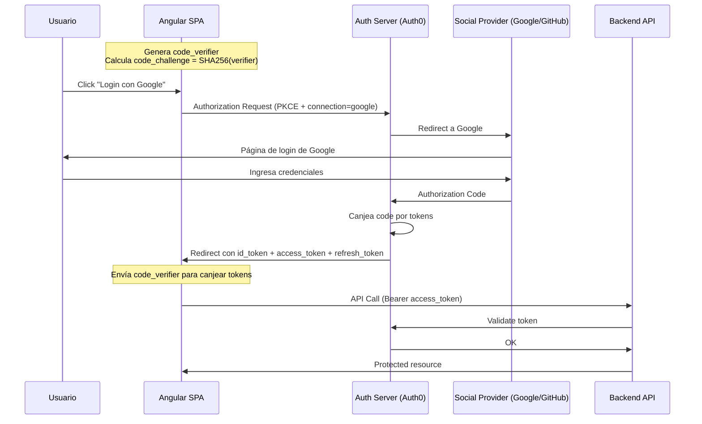
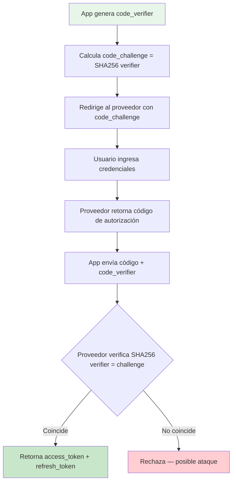

## 43 — OAuth 2.0 y Autenticación Social con PKCE

OAuth 2.0 en Angular con `angular-auth-oidc-client`, PKCE flow, refresh tokens, y login social (Google, GitHub, Microsoft) a través de Auth0.

> **Propósito:** Integrar autenticación OAuth 2.0 / OIDC con Angular usando PKCE flow, refresh tokens y múltiples providers (Google, GitHub, Microsoft).
>
> **Problema que resuelve:** Implementar OAuth manualmente es complejo (PKCE flow, state validation, token exchange) y riesgoso (access token en URL, CSRF). Sin PKCE, un atacante puede interceptar el código de autorización y canjearlo por tokens.
>
> **Cómo lo resuelve:** OAuth con PKCE (Proof Key for Code Exchange), estado aleatorio para prevenir CSRF, refresh tokens rotativos, login social via Auth0, y librería angular-auth-oidc-client que maneja el flujo completo con redirects.
>
> **Por qué aprenderlo:** OAuth 2.0 + OIDC es el estándar de autenticación delegada; usado por Google, Microsoft, GitHub, y todas las plataformas que permiten "Login with...". PKCE es obligatorio para aplicaciones SPA modernas.



### Conceptos Clave

- **OAuth 2.0**: Authorization Code + PKCE flow para aplicaciones SPA
- **`angular-auth-oidc-client`**: `OidcSecurityService`, `configure()`, `authorize()`, `checkAuth()`
- **PKCE**: code_verifier + code_challenge (SHA-256) — protege contra intercepción de códigos
- **Auth0**: Identity Provider que maneja autenticación y login social
- **OpenID Connect**: `id_token`, `userinfo`, claims — extiende OAuth2 con identidad
- **Login social**: Google, GitHub, Microsoft via Auth0 connections
- **Refresh tokens**: Renovación automática de tokens de acceso
- **Guards**: `canActivateFn` con OAuth, redirección a login
- **Backends**: Spring Boot, .NET, FastAPI como resource servers

### Flujo PKCE explicado



### Login Social — Cómo funciona

```mermaid
flowchart LR
    A[Click "Login con Google"] --> B[Auth0 recibe connection=google]
    B --> C[Auth0 redirige a Google]
    C --> D[Usuario autentica en Google]
    D --> E[Google retorna código a Auth0]
    E --> F[Auth0 canjea código por tokens]
    F --> G[Auth0 redirige a tu app con tokens]

    style A fill:#e3f2fd
    style G fill:#c8e6c9
```

### Configuración en Auth0

Para que este ejemplo funcione, necesitas configurar Auth0:

1. **Crea cuenta gratuita** en [auth0.com](https://auth0.com)
2. **Crea una Application** tipo "Single Page Application"
3. **Copia** tu Domain y Client ID
4. **Actualiza** `auth.config.ts` con tus credenciales
5. **Configura Allowed URLs** en Auth0 Dashboard:
   - Allowed Callback URLs: `http://localhost:4200`
   - Allowed Logout URLs: `http://localhost:4200`
   - Allowed Web Origins: `http://localhost:4200`

### Login Social — Configuración de proveedores

Cada proveedor social requiere configuración adicional en Auth0:

| Proveedor | Pasos en Auth0 | Callback URL |
|-----------|----------------|--------------|
| **Google** | Authentication > Social > Google. Necesitas Client ID y Secret de Google Cloud Console. | `https://YOUR_DOMAIN.auth0.com/login/callback` |
| **GitHub** | Authentication > Social > GitHub. Crea OAuth App en github.com/settings/developers. | `https://YOUR_DOMAIN.auth0.com/login/callback` |
| **Microsoft** | Authentication > Social > Microsoft. Crea App Registration en portal.azure.com. | `https://YOUR_DOMAIN.auth0.com/login/callback` |

### Proyecto

Login con PKCE + social login (Google, GitHub) usando Auth0 + `angular-auth-oidc-client`. Backend protegido con OAuth resource server.

### Ejercicios

1. Configura Auth0 con tu propia cuenta y actualiza `auth.config.ts`
2. Verifica que PKCE esté habilitado: observa el `code_verifier` en la consola del navegador
3. Habilita Google como proveedor social en Auth0
4. Implementa un guard que verifique el id_token antes de acceder a rutas protegidas
5. Crea un endpoint backend que valide el access_token

### Errores frecuentes

| Error | Causa | Solución |
|-------|-------|----------|
| `Invalid redirect_uri` | La URL de callback no está configurada en Auth0 | Agrega `http://localhost:4200` en Allowed Callback URLs |
| `PKCE validation failed` | El code_verifier no coincide con el challenge | Verifica que `usePKCE: true` y `codeChallengeMethod: 'S256'` estén configurados |
| `Unauthorized` en API | El access_token expiró o no se envió | Verifica que `silentRenew: true` y el interceptor estén configurados |
| Social login no aparece | El proveedor no está habilitado en Auth0 | Activa el proveedor en Authentication > Social |

### Cómo ejecutar

```bash
cd 43-oauth
npm install
ng serve --host 0.0.0.0 --port 8200
```

### Archivos del Proyecto

| Archivo | Carpeta | Propósito |
|---------|---------|-----------|
| `README.md` | Raíz | Documentación del proyecto |
| `angular.json` | Raíz | Configuración del workspace Angular |
| `package.json` | Raíz | Dependencias y scripts del proyecto |
| `tsconfig.json` | Raíz | Configuración base de TypeScript |
| `tsconfig.app.json` | Raíz | Configuración de TypeScript para la app |
| `package-lock.json` | Raíz | Bloqueo de versiones de dependencias |
| `src/index.html` | `src/` | HTML principal de la aplicación |
| `src/main.ts` | `src/` | Punto de entrada de la aplicación |
| `src/styles.css` | `src/` | Estilos globales |
| `src/app/app.config.ts` | `src/app/` | Configuración de providers (HTTP + OIDC) |
| `src/app/app.ts` | `src/app/` | Componente raíz — login, logout, datos del usuario |
| `src/app/app.css` | `src/app/` | Estilos del componente raíz |
| `src/app/app.html` | `src/app/` | Template — botones de login social y estándar |
| `src/app/auth.config.ts` | `src/app/` | Configuración OIDC con PKCE habilitado |
| `src/app/auth.guard.ts` | `src/app/` | Guard funcional que verifica autenticación |
| `src/app/auth.service.ts` | `src/app/` | Servicio de autenticación (login, logout, social) |
| `src/app/auth-providers.config.ts` | `src/app/` | Configuración de proveedores sociales (Google, GitHub, Microsoft) |
