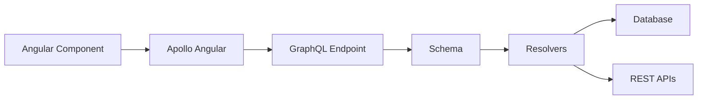

## 44 ÔÇö GraphQL con Apollo Angular

GraphQL en Angular con Apollo Client: queries, mutations, suscripciones, cach├® normalizada y paginaci├│n.

> **Prop├│sito:** Integrar Angular con GraphQL usando Apollo Angular: queries, mutations, subscriptions, caching normalizado y fragmentos reutilizables.
>
> **Problema que resuelve:** REST requiere m├║ltiples endpoints para datos relacionados (N+1 problem); los datos llegan con campos que no necesitas (overfetching) o faltan campos (underfetching).
>
> **C├│mo lo resuelve:** Apollo Angular con queries tipadas, mutations con optimistic updates, subscriptions para tiempo real, caching normalizado por ID, y fragments para componer queries.
>
> **Por qu├® aprenderlo:** GraphQL resuelve los problemas fundamentales de REST (over/under fetching, N+1) y es el est├índar en apps modernas con datos complejos.




### Conceptos Clave

- **Apollo Angular**: `APOLLO_OPTIONS`, `provideApollo`, `ApolloModule`
- **Queries**: `watchQuery`, `QueryRef`, `valueChanges` como se├▒al
- **Mutations**: `mutate`, `update` cach├®, refetchQueries
- **Cach├® normalizada**: `InMemoryCache`, `TypePolicy`, `dataIdFromObject`
- **Paginaci├│n**: `fetchMore`, `offset-based`, `cursor-based`
- **Suscripciones**: GraphQL subscriptions, WebSocket link
- **Fragments**: fragmentos reutilizables con `gql`
- **Apollo Angular Signals**: `watchQuery` retorna se├▒ales nativas
- **Optimistic UI**: respuesta inmediata antes de servidor

### Proyecto

GitHub API Explorer: buscar repositorios, ver detalles, paginaci├│n con cursor, y cach├® normalizada.

### Ejercicios

1. Configura Apollo Client con `provideApollo`
2. Implementa query de repositorios con se├▒ales
3. Implementa mutation con actualizaci├│n de cach├®
4. Implementa paginaci├│n con `fetchMore`
5. Usa fragmentos para compartir campos entre queries

### C├│mo ejecutar

```bash
cd 44-graphql
npm install
ng serve --host 0.0.0.0 --port 8080
```

### Archivos del Proyecto

| Archivo | Carpeta | Propósito |
|---------|---------|-----------|
| `README.md` | Raíz | Documentación del proyecto |
| `angular.json` | Raíz | Configuración del workspace Angular |
| `package.json` | Raíz | Dependencias y scripts del proyecto |
| `tsconfig.json` | Raíz | Configuración base de TypeScript |
| `tsconfig.app.json` | Raíz | Configuración de TypeScript para la app |
| `package-lock.json` | Raíz | Bloqueo de versiones de dependencias |
| `src/index.html` | `src/` | HTML principal de la aplicación |
| `src/main.ts` | `src/` | Punto de entrada de la aplicación |
| `src/styles.css` | `src/` | Estilos globales |
| `src/app/app.config.ts` | `src/app/` | Configuración de providers de Angular |
| `src/app/app.ts` | `src/app/` | Componente raíz de la aplicación |
| `src/app/app.css` | `src/app/` | Estilos del componente raíz |
| `src/app/app.html` | `src/app/` | Template del componente raíz |
| `src/app/graphql.config.ts` | `src/app/` | Configuración de Apollo Client |
| `src/app/users.query.ts` | `src/app/` | Query GraphQL de usuarios |
| `src/app/create-user.mutation.ts` | `src/app/` | Mutation GraphQL para crear usuario |
