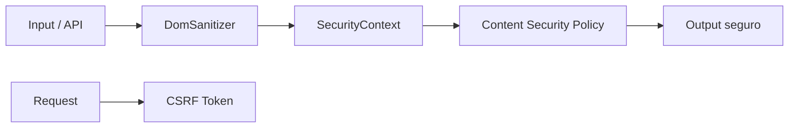

## 45 ÔÇö Seguridad Web

Seguridad en aplicaciones Angular: OWASP Top 10, CSP, XSS, CSRF, sanitizaci├│n con DomSanitizer, y SecurityContext.

> **Prop├│sito:** Implementar seguridad integral en Angular: CSP headers, sanitizaci├│n de inputs, protecci├│n XSS/CSRF, Content Security Policy y dependencias seguras.
>
> **Problema que resuelve:** Las aplicaciones Angular son vulnerables a XSS, inyecci├│n HTML, datos inseguros en templates y dependencias con CVEs conocidos.
>
> **C├│mo lo resuelve:** DomSanitizer desinfecta contenido inseguro, HttpOnly cookies + XSRF token para CSRF, CSP headers bloquean scripts inline maliciosos, npm audit + Snyk para dependencias.
>
> **Por qu├® aprenderlo:** La seguridad no es opcional; una brecha de seguridad puede costar millones. Angular proporciona herramientas built-in contra XSS que todo desarrollador debe conocer.




### Conceptos Clave

- **OWASP Top 10**: XSS, CSRF, Injection, Broken Authentication
- **`DomSanitizer`**: `sanitize()`, `SecurityContext.HTML`, `bypassSecurityTrust*`
- **XSS prevención**: Angular automático con interpolación, `DomSanitizer` para contenido confiable
- **CSP (Content Security Policy)**: `Content-Security-Policy` header, `nonce`, `strict-dynamic`
- **CSRF**: `HttpXsrfInterceptor`, `withXsrfConfiguration()`, SameSite cookies
- **HTTP Headers**: `X-Content-Type-Options`, `X-Frame-Options`, `Strict-Transport-Security`
- **Auth tokens seguros**: HttpOnly cookies vs localStorage
- **`trusted-types`**: CSP con trusted types policy
- **Sanitizaci├│n**: DOMPurify para HTML externo

### Proyecto

Auditoría de seguridad de la app: implementar CSP headers, sanitizar HTML externo, configurar XSRF, y corregir vulnerabilidades.

### Ejercicios

1. Configura CSP headers con nonce en NGINX/backend
2. Usa `DomSanitizer` con `SecurityContext.HTML` de forma segura
3. Implementa DOMPurify para contenido HTML de terceros
4. Configura `withXsrfConfiguration` y verifica tokens
5. Agrega HTTP security headers en la respuesta del servidor

### C├│mo ejecutar

```bash
cd 45-seguridad
npm install
ng serve --host 0.0.0.0 --port 8080
```

### Archivos del Proyecto

| Archivo | Carpeta | Propósito |
|---------|---------|-----------|
| `README.md` | Raíz | Documentación del proyecto |
| `angular.json` | Raíz | Configuración del workspace Angular |
| `package.json` | Raíz | Dependencias y scripts del proyecto |
| `tsconfig.json` | Raíz | Configuración base de TypeScript |
| `tsconfig.app.json` | Raíz | Configuración de TypeScript para la app |
| `package-lock.json` | Raíz | Bloqueo de versiones de dependencias |
| `src/index.html` | `src/` | HTML principal de la aplicación |
| `src/main.ts` | `src/` | Punto de entrada de la aplicación |
| `src/styles.css` | `src/` | Estilos globales |
| `src/app/app.config.ts` | `src/app/` | Configuración de providers de Angular |
| `src/app/app.ts` | `src/app/` | Componente raíz de la aplicación |
| `src/app/app.css` | `src/app/` | Estilos del componente raíz |
| `src/app/app.html` | `src/app/` | Template del componente raíz |
| `src/app/csp.service.ts` | `src/app/` | Servicio de Content Security Policy |
| `src/app/sanitize.pipe.ts` | `src/app/` | Pipe de sanitización de contenido HTML |
| `src/app/security-headers.ts` | `src/app/` | Configuración de headers de seguridad |
| `src/app/xss-protection.interceptor.ts` | `src/app/` | Interceptor HTTP para protección XSS |
