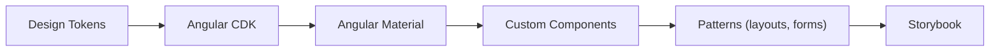

## 46 ÔÇö Design System con Angular CDK + Material

Creaci├│n de un Design System completo con Angular CDK, Angular Material, design tokens y Storybook.

> **Propósito:** Crear un Design System interno con Angular: componentes base, variantes por props, tokens de diseño (colores, tipografía, spacing), documentación con Storybook.
>
> **Problema que resuelve:** Sin Design System, cada equipo/feature implementa sus propios estilos resultando en interfaces inconsistentes, duplicaci├│n de c├│digo y dificultad de mantenimiento.
>
> **Cómo lo resuelve:** Componentes base con variantes configurables vía inputs, CSS custom properties como design tokens, Storybook como catálogo vivo, y npm package para compartir.
>
> **Por qu├® aprenderlo:** Los Design Systems son el est├índar en organizaciones con m├║ltiples equipos/productos; reducen el tiempo de desarrollo UI en un 50% y garantizan consistencia visual.




### Conceptos Clave

- **Angular CDK**: `@angular/cdk`, `overlay`, `portal`, `drag-drop`, `a11y`, `table`
- **Angular Material**: `@angular/material`, componentes MDC, theming
- **Design Tokens**: variables CSS, tokens tipados con TypeScript
- **Componentes headless**: CDK primitives sin estilos predefinidos
- **Theming**: `defineTheme`, paletas, tipografía, densidades
- **CVA (Control Value Accessor)**: componentes de formulario personalizados
- **Storybook**: documentaci├│n visual de cada componente
- **Componentes**: Button, Input, Select, Modal, Table, Toast, DatePicker
- **Modo oscuro**: paleta de colores dinámica con señales

### Proyecto

Design System completo con 10+ componentes, theming dinámico con señales, modo oscuro y documentación en Storybook.

### Ejercicios

1. Configura Angular Material con tema personalizado
2. Crea un `Button` component con variantes usando CDK
3. Implementa `ControlValueAccessor` para Input personalizado
4. Crea un `Modal` con `CdkPortal` y `Overlay`
5. Registra todos los componentes en Storybook
6. Implementa modo oscuro con se├▒ales y CSS variables

### C├│mo ejecutar

```bash
cd 46-design-system
npm install
ng serve --host 0.0.0.0 --port 8080
```

### Archivos del Proyecto

| Archivo | Carpeta | Propósito |
|---------|---------|-----------|
| `README.md` | Raíz | Documentación del proyecto |
| `angular.json` | Raíz | Configuración del workspace Angular |
| `package.json` | Raíz | Dependencias y scripts del proyecto |
| `tsconfig.json` | Raíz | Configuración base de TypeScript |
| `tsconfig.app.json` | Raíz | Configuración de TypeScript para la app |
| `package-lock.json` | Raíz | Bloqueo de versiones de dependencias |
| `src/index.html` | `src/` | HTML principal de la aplicación |
| `src/main.ts` | `src/` | Punto de entrada de la aplicación |
| `src/styles.css` | `src/` | Estilos globales |
| `src/styles/tokens.css` | `src/styles/` | Design tokens (variables CSS) |
| `src/app/app.config.ts` | `src/app/` | Configuración de providers de Angular |
| `src/app/app.ts` | `src/app/` | Componente raíz del design system |
| `src/app/badge/badge.ts` | `src/app/badge/` | Componente Badge del design system |
| `src/app/button/button.ts` | `src/app/button/` | Componente Button con variantes |
| `src/app/card/card.ts` | `src/app/card/` | Componente Card del design system |
| `src/app/input/input.ts` | `src/app/input/` | Componente Input con ControlValueAccessor |
