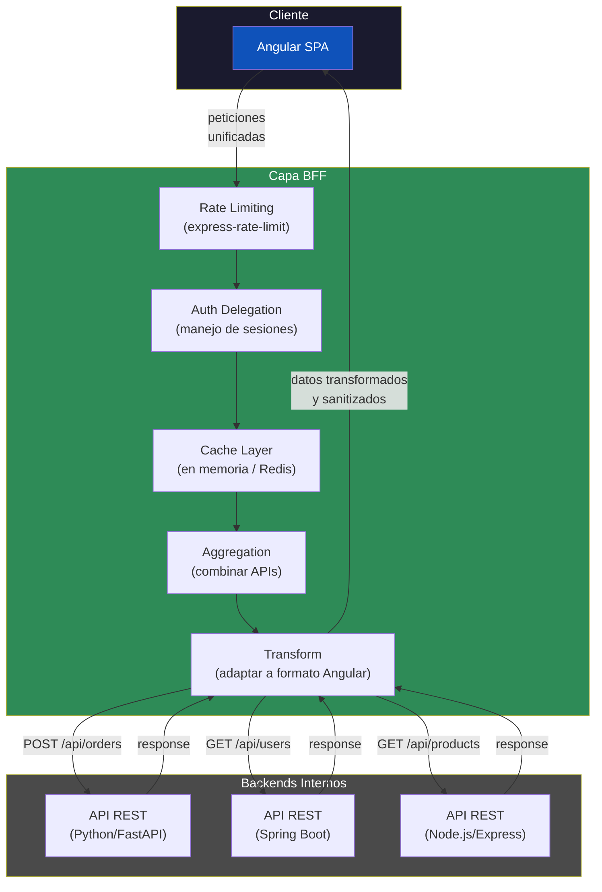
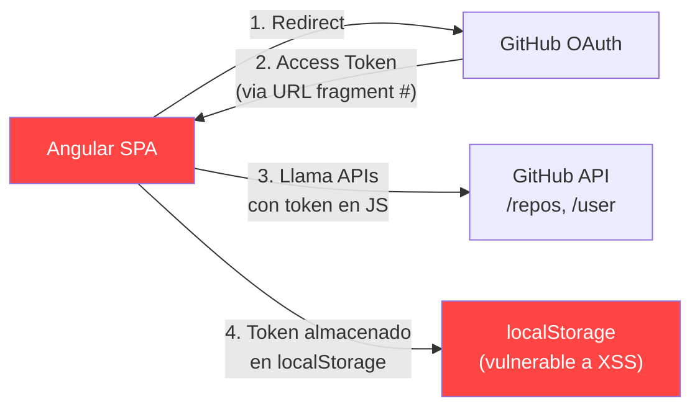
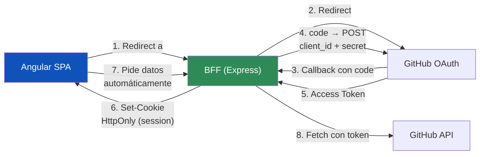
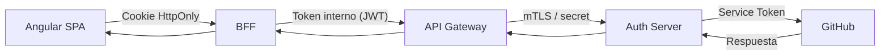

## 47 — Backend for Frontend (BFF)

Patrón BFF con Express/FastAPI/Spring Boot: backend específico para el frontend Angular, agregación de APIs y seguridad.

> **Propósito:** Implementar el patrón Backend-for-Frontend (BFF) con Node.js/Express: agregación de APIs, sanitización de datos, autenticación delegada y tipos compartidos con Angular.
>
> **Problema que resuelve:** El frontend no debería llamar directamente a múltiples microservicios (latencias, datos sensibles, versionado de APIs); sin BFF cada cambio de backend requiere cambio frontend.
>
> **Cómo lo resuelve:** BFF con Express que agrega datos de múltiples backends, sanitiza lo que envía al frontend, maneja autenticación y comparte tipos TypeScript con Angular.
>
> **Por qué aprenderlo:** BFF es el patrón recomendado por arquitectos para desacoplar frontend de backends; adoptado por Netflix, SoundCloud y ThoughtWorks.



### Caso real: Autenticación con GitHub OAuth2

Imagina que tu app Angular permite "Iniciar sesión con GitHub". Hay 3 formas de implementarlo, de menos segura a más segura:

#### Modelo A: SPA directo (menos seguro)



**Problemas:** El token de GitHub queda expuesto en el navegador. Cualquier XSS lo roba. El token vive en `localStorage` accesible por JavaScript. No hay control centralizado.

#### Modelo B: BFF con sesión (seguro — RECOMENDADO)



**Ventajas:** El `client_secret` JAMÁS sale del BFF. El token de GitHub nunca está en el navegador. Angular solo recibe una cookie HttpOnly (inaccesible por JS). Si hay XSS, el atacante no puede robar tokens.

#### Modelo C: Backend-for-Backend (enterprise)



**Para qué sirve:** En empresas grandes donde hay compliance (SOC2, PCI). Nadie tiene acceso directo a GitHub, todo pasa por un proxy corporativo. El Angular ni siquiera sabe que GitHub existe.

### Comparación visual de los 3 modelos (ordenados de MENOS a MÁS seguro)

| Aspecto | Modelo A (SPA directo) | Modelo B (BFF) | Modelo C (B2B Gateway) |
|---------|----------------------|----------------|----------------------|
| ¿Dónde está el token? | `localStorage` (browser) | Cookie HttpOnly (browser) | Servidor interno |
| ¿Vulnerable a XSS? | **Sí** — el token se roba | No — cookie HttpOnly | No |
| `client_secret` expuesto? | **Sí** — en código JS | No — solo en BFF | No |
| Control de sesión | Ninguno | Rate limiting + revocación | mTLS + políticas de red |
| Aislamiento del frontend | Ninguno | Angular no ve tokens | Angular no ve nada |
| Complejidad | Baja | Media | Alta |
| **¿Cuándo usarlo?** | Prototipos, apps internas | **Producción, startups, SaaS** | Bancos, salud, enterprise |

**El Modelo C (B2B Gateway) es el más seguro**, pero por eso mismo se usa en empresas grandes: el Angular ni siquiera sabe que GitHub existe. Todo pasa por un API Gateway corporativo que exige mTLS, políticas de red fijas, y rotación de secrets. El trade-off es complejidad operativa.

### ¿Por qué BFF gana al Modelo A?

Sin BFF, tu app Angular para que el usuario importe repositorios de GitHub haría:

1. **Angular** redirige a `/login/github`
2. **GitHub** devuelve `access_token` en el fragmento `#` de la URL
3. **Angular** extrae el token y lo guarda en `localStorage`
4. **Angular** usa ese token para llamar a `api.github.com` directamente

**Riesgos concretos:**
- El `client_secret` está en código JavaScript (visible en DevTools)
- El token viaja por el navegador → cualquier extensión maliciosa lo ve
- No puedes revocar sesiones centralizadamente
- No hay rate limiting contra abusos

Con BFF:

1. **Angular** redirige a `GET /api/auth/github` en el BFF
2. El **BFF** (Express) redirige a GitHub con `client_id` + `redirect_uri`
3. **GitHub** llama al callback del BFF (`/api/auth/github/callback`)
4. El **BFF** canjea el `code` por `access_token` usando `client_secret` (nunca sale del servidor)
5. El **BFF** crea una sesión y devuelve una cookie HttpOnly
6. **Angular** hace peticiones al BFF, y el BFF adjunta el token de GitHub

### Conceptos Clave

| Concepto | Descripción |
|----------|-------------|
| **BFF** | Backend intermedio entre Angular y servicios internos |
| **Express BFF** | Proxy inverso, agregación de múltiples APIs |
| **FastAPI BFF** | Python asíncrono, agregación y transformación |
| **Spring Boot BFF** | Ruteo, filtrado, rate limiting |
| **Rate Limiting** | `express-rate-limit`, protección contra abusos |
| **Agregación** | Combinar respuestas de múltiples servicios en una |
| **Transformación** | Adaptar datos al formato que necesita Angular |
| **Auth delegation** | Sesión mantenida en BFF, tokens gestionados en servidor |
| **Caching** | Respuestas cacheadas en BFF para reducir latencia |
| **Sanitización** | Filtrar datos sensibles antes de enviarlos al frontend |

### ¿Por qué usar BFF con Angular?

1. **Seguridad**: los tokens y secrets nunca llegan al navegador
2. **Rendimiento**: una sola llamada desde Angular reemplaza N llamadas a microservicios
3. **Desacoplamiento**: Angular solo conoce el BFF, no la topología interna
4. **Transformación**: el BFF adapta datos legacy al formato exacto que espera el frontend
5. **Rate limiting**: protege los backends internos de abusos desde el cliente

### Proyecto

BFF con Express/FastAPI que agrega datos de 3 APIs externas, implementa rate limiting y caching, y sirve a Angular.

### Ejercicios

1. Configura Express como BFF con rutas para Angular
2. Implementa rate limiting en rutas sensibles
3. Agrega datos de 3 APIs en un solo endpoint BFF
4. Transforma datos al formato esperado por Angular
5. Implementa caching con Redis o en memoria

### Cómo ejecutar

```bash
cd 47-bff
npm install
npm run server       # BFF Express en http://localhost:3001
# En otra terminal:
ng serve             # Angular en http://localhost:4200
```

O todo junto:

```bash
npm run dev:all      # Express + Angular con concurrently
```

Probar el BFF directamente:

```bash
curl http://localhost:3001/api/bff/dashboard -H "x-session-id: session-123"
```
