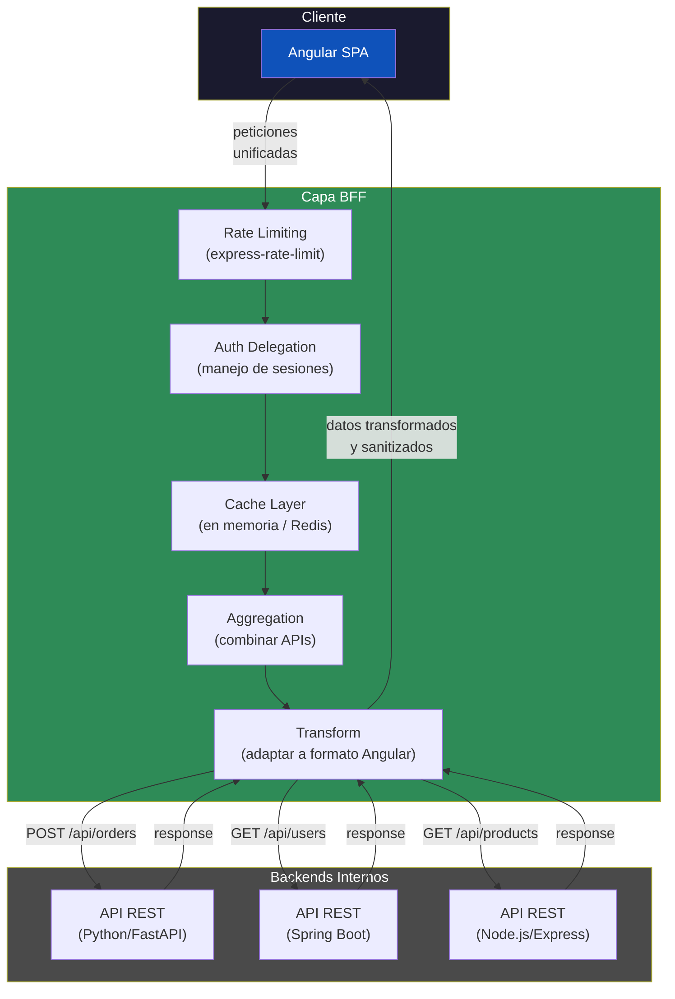

## 47 — Backend for Frontend (BFF)

Patrón BFF con Express/FastAPI/Spring Boot: backend específico para el frontend Angular, agregación de APIs y seguridad.

> **Propósito:** Implementar el patrón Backend-for-Frontend (BFF) con Node.js/Express: agregación de APIs, sanitización de datos, autenticación delegada y tipos compartidos con Angular.
>
> **Problema que resuelve:** El frontend no debería llamar directamente a múltiples microservicios (latencias, datos sensibles, versionado de APIs); sin BFF cada cambio de backend requiere cambio frontend.
>
> **Cómo lo resuelve:** BFF con Express que agrega datos de múltiples backends, sanitiza lo que envía al frontend, maneja autenticación y comparte tipos TypeScript con Angular.
>
> **Por qué aprenderlo:** BFF es el patrón recomendado por arquitectos para desacoplar frontend de backends; adoptado por Netflix, SoundCloud y ThoughtWorks.



### Conceptos Clave

| Concepto | Descripción |
|----------|-------------|
| **BFF** | Backend intermedio entre Angular y servicios internos |
| **Express BFF** | Proxy inverso, agregación de múltiples APIs |
| **FastAPI BFF** | Python asíncrono, agregación y transformación |
| **Spring Boot BFF** | Ruteo, filtrado, rate limiting |
| **Rate Limiting** | `express-rate-limit`, protección contra abusos |
| **Agregación** | Combinar respuestas de múltiples servicios en una |
| **Transformación** | Adaptar datos al formato que necesita Angular |
| **Auth delegation** | Sesión mantenida en BFF, tokens gestionados en servidor |
| **Caching** | Respuestas cacheadas en BFF para reducir latencia |
| **Sanitización** | Filtrar datos sensibles antes de enviarlos al frontend |

### ¿Por qué usar BFF con Angular?

1. **Seguridad**: los tokens y secrets nunca llegan al navegador
2. **Rendimiento**: una sola llamada desde Angular reemplaza N llamadas a microservicios
3. **Desacoplamiento**: Angular solo conoce el BFF, no la topología interna
4. **Transformación**: el BFF adapta datos legacy al formato exacto que espera el frontend
5. **Rate limiting**: protege los backends internos de abusos desde el cliente

### Proyecto

BFF con Express/FastAPI que agrega datos de 3 APIs externas, implementa rate limiting y caching, y sirve a Angular.

### Ejercicios

1. Configura Express como BFF con rutas para Angular
2. Implementa rate limiting en rutas sensibles
3. Agrega datos de 3 APIs en un solo endpoint BFF
4. Transforma datos al formato esperado por Angular
5. Implementa caching con Redis o en memoria

### Cómo ejecutar

```bash
cd 47-bff
npm install
npm run dev:all
```
