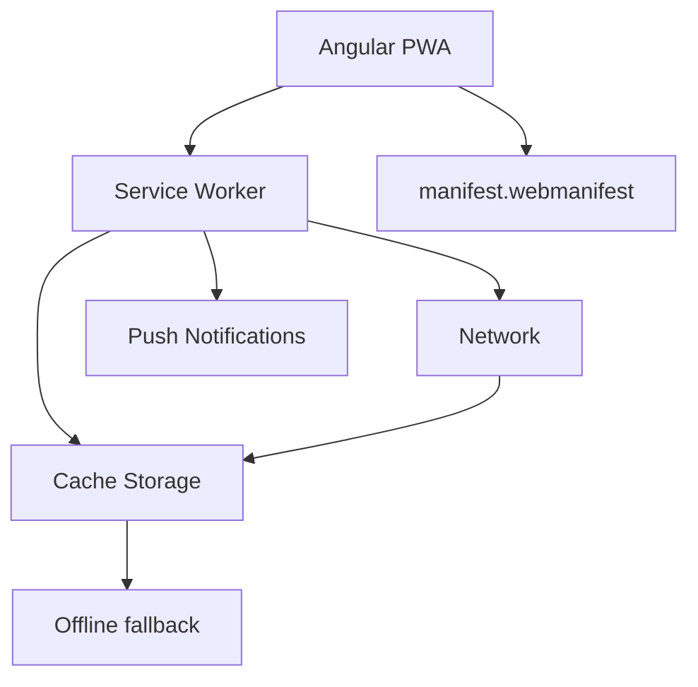

## 48 ÔÇö PWA (Progressive Web App)

Aplicaci├│n web progresiva con Angular: Service Worker, IndexedDB, offline-first, y push notifications.

> **Prop├│sito:** Convertir Angular en Progressive Web App: service worker, manifest, offline support, push notifications, caching strategies y Lighthouse audit.
>
> **Problema que resuelve:** Las SPAs tradicionales no funcionan sin internet, no se pueden instalar en el homescreen y no envían notificaciones push como apps nativas.
>
> **C├│mo lo resuelve:** @angular/service-worker con caching strategies (CacheFirst, NetworkFirst, StaleWhileRevalidate), manifest.json para instalaci├│n, Web Push API para notificaciones.
>
> **Por qu├® aprenderlo:** PWAs ofrecen experiencia nativa sin pasar por app stores; mejoran engagement (push notifications), retenci├│n (instalable) y alcance (no requiere descarga).




### Conceptos Clave

- **`@angular/pwa`**: `ng add @angular/pwa`, `ngsw-config.json`
- **Service Worker**: `SwPush`, `SwUpdate`, `SwRegistration`
- **Estrategias de cach├®**: `performance`, `freshness`, network-first
- **Offline-first**: app funcional sin conexi├│n, sincronizaci├│n posterior
- **IndexedDB**: `idb` library, `Dexie.js`, almacenamiento offline
- **Manifest**: `manifest.webmanifest`, `icons`, `display: standalone`
- **Push notifications**: `SwPush`, `requestSubscription()`, VAPID keys
- **Update management**: `SwUpdate.versionUpdates`, `activateUpdate()`
- **`@angular/service-worker`**: `ServiceWorkerModule`, `SwRegistrationOptions`

### Proyecto

App de notas offline-first con Angular PWA: crear/editar offline, sincronizar al reconectar, notificaciones push.

### Ejercicios

1. A├▒ade PWA con `ng add @angular/pwa`
2. Configura estrategias de cach├® en `ngsw-config.json`
3. Implementa almacenamiento offline con IndexedDB
4. Agrega push notifications con VAPID
5. Muestra indicador de conectividad/offline

### C├│mo ejecutar

```bash
cd 48-pwa
npm install
ng build && ng serve --host 0.0.0.0 --port 8080 --configuration production
```

### Archivos del Proyecto

| Archivo | Carpeta | Propósito |
|---------|---------|-----------|
| `README.md` | Raíz | Documentación del proyecto |
| `angular.json` | Raíz | Configuración del workspace Angular |
| `package.json` | Raíz | Dependencias y scripts del proyecto |
| `tsconfig.json` | Raíz | Configuración base de TypeScript |
| `tsconfig.app.json` | Raíz | Configuración de TypeScript para la app |
| `package-lock.json` | Raíz | Bloqueo de versiones de dependencias |
| `ngsw-config.json` | Raíz | Configuración del Service Worker de Angular |
| `src/index.html` | `src/` | HTML principal de la aplicación |
| `src/main.ts` | `src/` | Punto de entrada de la aplicación |
| `src/styles.css` | `src/` | Estilos globales |
| `src/manifest.webmanifest` | `src/` | Manifest de aplicación web progresiva |
| `src/app/app.config.ts` | `src/app/` | Configuración de providers de Angular |
| `src/app/app.ts` | `src/app/` | Componente raíz de la aplicación |
| `src/app/check-for-update.service.ts` | `src/app/` | Servicio de detección de actualizaciones del SW |
| `public/icon-192x192.png` | `public/` | Icono PWA 192x192 |
| `public/icon-512x512.png` | `public/` | Icono PWA 512x512 |
