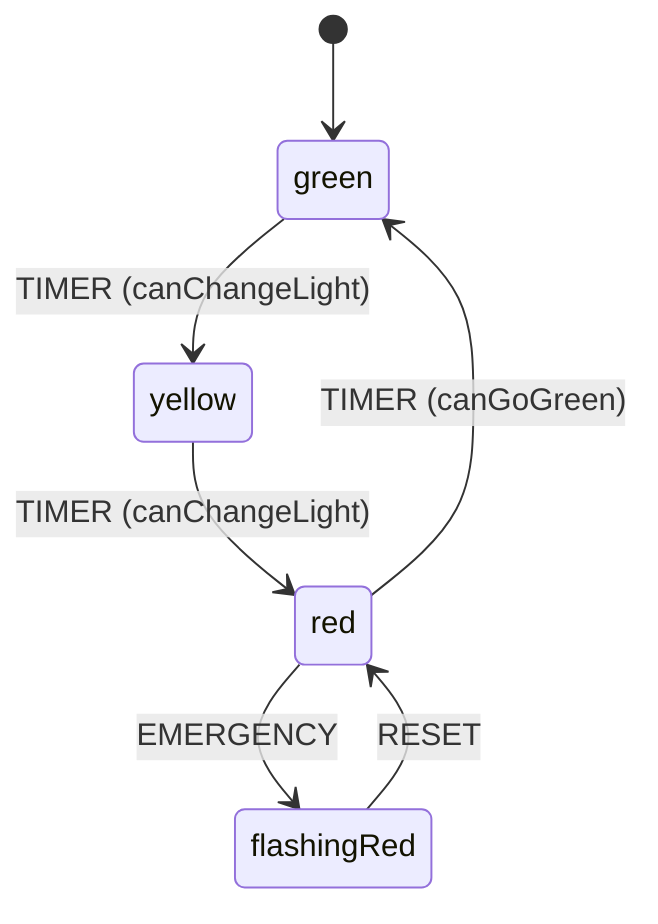
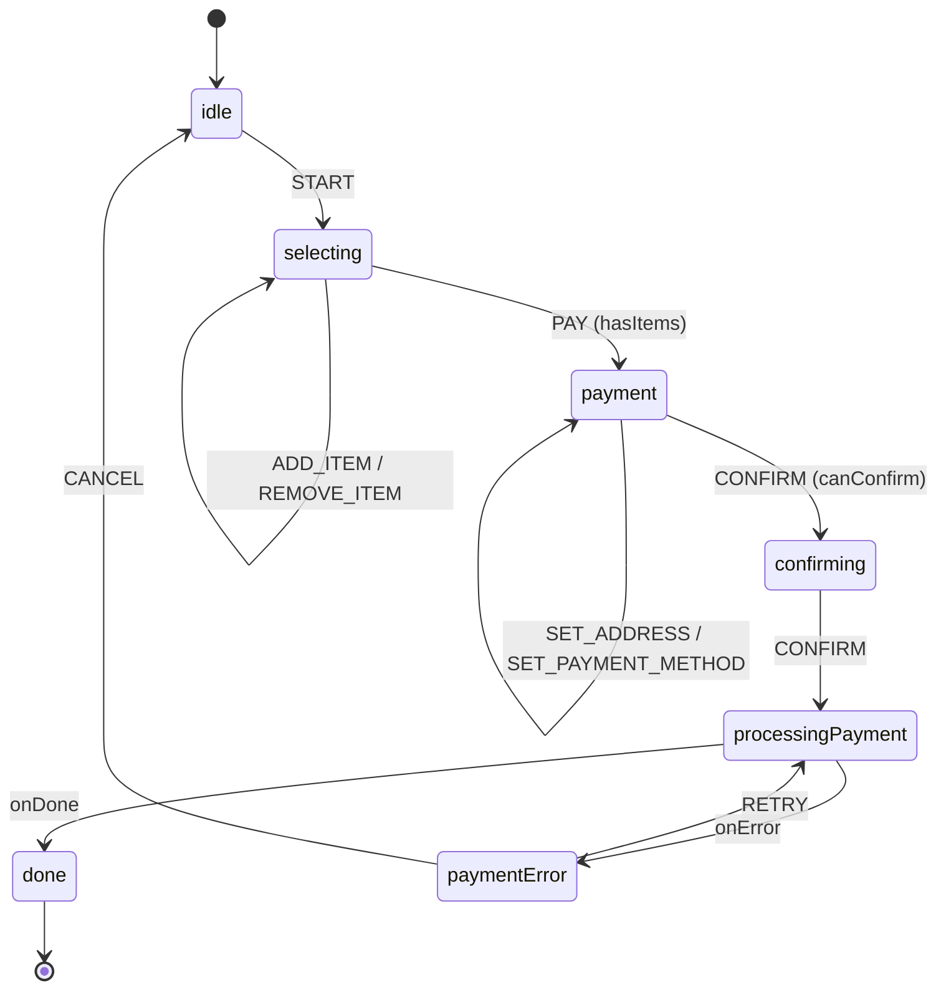

## 49 — State Machines (Máquinas de Estado)

State machines con XState + Angular: flujos complejos, checkouts multi-paso, y modelado de procesos.

> **Propósito:** Gestionar flujos complejos con XState en Angular: state machines, guards, actions, invoke, y manejo de estado asíncrono.
>
> **Problema que resuelve:** El estado booleano múltiple (isLoading, isError, isSuccess) crea estados imposibles (isLoading && isError) y difícil de mantener; flujos complejos como un wizard o checkout se vuelven caóticos.
>
> **Cómo lo resuelve:** XState define estados, transiciones y guards explícitamente (solo un estado activo a la vez), con acciones para efectos secundarios y servicios invocables para lógica asíncrona.
>
> **Por qué aprenderlo:** State machines eliminan estados imposibles de raíz; XState es el estándar para flujos complejos (onboarding, checkout, multi-step forms) en producción.


```mermaid
flowchart LR
    IDLE["idle"] -->|START| SEL["selecting"]
    SEL -->|ADD_ITEM| SEL
    SEL -->|REMOVE_ITEM| SEL
    SEL -->|PAY (hasItems)| PAY["payment"]
    PAY -->|SET_ADDRESS| PAY
    PAY -->|SET_PAYMENT_METHOD| PAY
    PAY -->|CONFIRM (canConfirm)| CONF["confirming"]
    CONF -->|CONFIRM| PROC["processingPayment"]
    PROC -->|onDone| DONE["done"]
    PROC -->|onError| ERR["paymentError"]
    ERR -->|RETRY| PROC
    ERR -->|CANCEL| IDLE
```

### Conceptos Clave

#### 1. Context — Memoria de la máquina

**Qué es:** El `context` son datos que la máquina guarda y puede modificar. Es como la "memoria" del carrito de compras o el tablero de un juego.

**Por qué importa:** Sin context, la máquina solo sabe "en qué estado está". Con context, también sabe "qué datos tiene". Por ejemplo, un checkout necesita recordar qué items compró el usuario.

**Código:**
```typescript
// Definir el context en setup()
export const checkoutMachine = setup({
  types: {
    context: {} as {
      items: Array<{ id: number; name: string; price: number }>;
      total: number;
      address: string;
    },
  },
}).createMachine({
  context: {
    items: [],   // Datos iniciales del carrito
    total: 0,
    address: '',
  },
  // ...
});
```

**Analogía:** Imagina un mesero en un restaurante. El `context` es su libreta donde apunta qué ordered cada mesa. Sin la libreta, no recordaría nada.

---

#### 2. Actions — Efectos secundarios con assign()

**Qué es:** Las `actions` son código que se ejecuta cuando ocurre una transición o se entra/sale de un estado. `assign()` es la acción más común: modifica el context.

**Por qué importa:** Las actions permiten que la máquina reaccione a eventos modificando sus datos. Sin assign(), la máquina cambiaría de estado pero no recordaría nada.

**Código:**
```typescript
// assign() modifica el context de forma inmutable
assign({
  // Parámetro { context, event }: acceso al context actual y al evento recibido
  items: ({ context, event }) => [
    ...context.items,        // Copia items existentes (spread operator)
    { ...event.item, quantity: 1 } // Agrega el nuevo item
  ],
  // Recalcula el total
  total: ({ context, event }) => context.total + event.price,
})

// entry/exit actions: se ejecutan al entrar/salir de un estado
states: {
  green: {
    entry: [assign({ countdown: 5 })],  // Al entrar: reinicia timer
    exit: [assign({ log: 'Leaving green' })], // Al salir: log
  }
}
```

**Analogía:** El mesero escribe "Mesa 3: 2 hamburguesas" en su libreta. Esa escritura es un `assign()`: modifica la libreta (context) sin cambiar de estado.

---

#### 3. Guards — Condiciones para transiciones

**Qué es:** Los `guards` son condiciones que deben cumplirse para que una transición ocurra. Si el guard retorna `false`, la transición no ocurre.

**Por qué importa:** Los guards validan datos antes de permitir acciones. Por ejemplo, no puedes pagar si el carrito está vacío, o confirmar sin dirección.

**Código:**
```typescript
// Definir guards en setup()
guards: {
  hasItems: ({ context }) => context.items.length > 0,
  hasAddress: ({ context }) => context.address.trim().length > 0,
  canConfirm: ({ context }) =>
    context.address.trim().length > 0 &&
    context.paymentMethod.length > 0,
},

// Usar guards en transiciones
on: {
  PAY: {
    target: 'payment',
    guard: 'hasItems', // Solo avanza si hay items
  },
  CONFIRM: {
    target: 'confirming',
    guard: 'canConfirm', // Necesita dirección Y método de pago
  },
}
```

**Analogía:** El guardia de la puerta de un club. "¿Tienes entrada?" (hasItems). "¿Eres mayor de edad?" (hasAddress). Si no cumples, no pasas.

---

#### 4. Invoke — Servicios asíncronos

**Qué es:** `invoke` llama a un servicio asincrónico (API, Promise, Observable) y maneja automáticamente el loading, success y error.

**Por qué importa:** En aplicaciones reales, necesitas llamar a APIs (pagos, autenticación, etc.). XState maneja el ciclo de vida completo: loading → success/error → siguiente estado.

**Código:**
```typescript
// invoke con fromPromise: llama a una Promise
invoke: {
  src: fromPromise(async ({ input }) => {
    // input: datos del context que se pasan al servicio
    const response = await fetch('/api/payment', {
      method: 'POST',
      body: JSON.stringify(input),
    });
    if (!response.ok) throw new Error('Payment failed');
    return response.json(); // → event.output en onDone
  }),
  input: ({ context }) => ({
    items: context.items,
    total: context.total,
  }),
},
// onDone: la Promise resolvió exitosamente
onDone: {
  target: 'done',
  actions: assign({
    paymentId: ({ event }) => event.output.paymentId,
  }),
},
// onError: la Promise falló
onError: {
  target: 'error',
  actions: assign({
    error: ({ event }) => event.error.message,
  }),
},
```

**Analogía:** Llamas a un restaurante para hacer un pedido (invoke). Mientras esperas, estás en estado "loading". Si responden "pedido confirmado" → success. Si dicen "no tenemos" → error.

---

#### 5. entry/exit actions — Acciones por estado

**Qué es:** Las `entry` actions se ejecutan al ENTRAR a un estado. Las `exit` actions se ejecutan al SALIR. Son ideales para logging, reiniciar timers, o cleanup.

**Por qué importa:** Permiten ejecutar código determinístico cada vez que se llega a un estado, sin depender de qué evento causó la transición.

**Código:**
```typescript
states: {
  green: {
    entry: [
      assign({
        countdown: 5,  // Reinicia timer cada vez que entra a verde
        log: ({ context }) => [...context.log, '🟢 Entering green'],
      }),
    ],
    exit: [
      assign({
        log: ({ context }) => [...context.log, '🟢 Leaving green'],
      }),
    ],
  },
}
```

**Analogía:** Cuando llegas a la oficina (entry), prendes las luces y abres la computadora. Cuando te vas (exit), apagas todo y cierras la puerta. No importa si te fuiste temprano o tarde, siempre haces lo mismo.

---

#### 6. Eventos con payload — Datos en eventos

**Qué es:** Los eventos pueden llevar datos adicionales (payload). Por ejemplo, `ADD_ITEM` lleva el item que se agrega.

**Por qué importa:** Permite que la máquina reciba información del mundo exterior y la use para modificar el context.

**Código:**
```typescript
// Definir evento con payload
events: {} as
  | { type: 'ADD_ITEM'; item: { id: number; name: string; price: number } }
  | { type: 'SET_ADDRESS'; address: string },

// Usar el payload en actions
actions: assign({
  items: ({ context, event }) => [
    ...context.items,
    event.item, // ← acceso al payload del evento
  ],
})
```

**Analogía:** El mesero no solo anota "agregar platillo", sino "agregar platillo #5: hamburguesa con queso". El payload es el detalle específico.

---

### Máquina de Semáforo — Ejemplo completo

La máquina de semáforo demuestra:
- **Context**: countdown, cycleCount, maxCycles, log
- **Guards**: `canChangeLight` (countdown ≤ 0), `canGoGreen` (cycleCount < maxCycles)
- **Entry/Exit actions**: logging y reinicio de timers
- **Transiciones condicionales**: no vuelve a verde si alcanzó el máximo de ciclos



### Máquina de Checkout — Ejemplo completo

La máquina de checkout demuestra:
- **Context**: items, total, address, paymentMethod, error, paymentId
- **Guards**: hasItems, hasAddress, hasPaymentMethod, canConfirm
- **Actions**: ADD_ITEM, REMOVE_ITEM, SET_ADDRESS, SET_PAYMENT_METHOD
- **Invoke**: processingPayment llama a un API simulado con `fromPromise`
- **Manejo de error**: paymentError permite retry o cancel



### Errores Más Frecuentes

| # | Error | Causa | Solución |
|---|-------|-------|----------|
| 1 | **Mutar context directamente** | `context.items.push(item)` | Usa `assign()` con spread: `items: [...context.items, item]` |
| 2 | **Olvidar el tipo del context** | `context: {} as any` | Define tipos explícitos en `types.context` |
| 3 | **Guard sin acceso al context** | `guard: () => true` | Usa `({ context }) => context.items.length > 0` |
| 4 | **Invoke sin manejar error** | Solo `onDone`, sin `onError` | Siempre maneja `onError` para APIs |
| 5 | **No pasar input al invoke** | `invoke: { src: fromPromise(...) }` | Agrega `input: ({ context }) => ({...})` |
| 6 | **Usar assign() fuera de la máquina** | `actor.send(assign({...}))` | assign() solo va dentro de states/transitions |

### Ejercicios

1. **Traffic Light mejorado**: Agrega un timer automático que envíe `TIMER` cada N segundos (usa `setInterval` en el componente)
2. **Checkout con persistencia**: Guarda el context del checkout en `localStorage` para recuperarlo si el usuario recarga la página
3. **Guards personalizados**: Implementa un guard `isNightMode` que cambie la duración del semáforo según la hora del día
4. **Invoke con retry**: Modifica el invoke del checkout para reintentar automáticamente 2 veces antes de ir a error
5. **Historial de estados**: Agrega un action que guarde un historial de estados visitados (usa `assign` para agregar al array)

### Cómo ejecutar

```bash
cd 49-state-machines
npm install
ng serve --host 0.0.0.0 --port 8080
```

### Archivos del Proyecto

| Archivo | Carpeta | Propósito |
|---------|---------|-----------|
| `README.md` | Raíz | Documentación del proyecto |
| `angular.json` | Raíz | Configuración del workspace Angular |
| `package.json` | Raíz | Dependencias y scripts del proyecto |
| `tsconfig.json` | Raíz | Configuración base de TypeScript |
| `tsconfig.app.json` | Raíz | Configuración de TypeScript para la app |
| `package-lock.json` | Raíz | Bloqueo de versiones de dependencias |
| `src/index.html` | `src/` | HTML principal de la aplicación |
| `src/main.ts` | `src/` | Punto de entrada de la aplicación |
| `src/styles.css` | `src/` | Estilos globales |
| `src/app/app.config.ts` | `src/app/` | Configuración de providers de Angular |
| `src/app/app.ts` | `src/app/` | Componente raíz de la aplicación |
| `src/app/checkout.ts` | `src/app/` | Componente de checkout con context, guards, invoke |
| `src/app/traffic-light.ts` | `src/app/` | Componente semáforo con context, guards, actions |
| `src/machines/checkout.machine.ts` | `src/machines/` | Máquina checkout: context, guards, invoke |
| `src/machines/traffic-light.machine.ts` | `src/machines/` | Máquina semáforo: context, guards, entry/exit |
| `src/services/machine.service.ts` | `src/services/` | Servicio de interpretación de máquinas XState |
