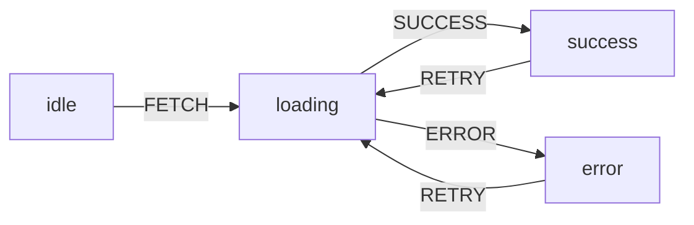

## 49 ÔÇö State Machines (M├íquinas de Estado)

State machines con XState + Angular: flujos complejos, checkouts multi-paso, y modelado de procesos.

> **Propósito:** Gestionar flujos complejos con XState en Angular: state machines, guards, actions, actors, y máquinas asíncronas con servicios invocables.
>
> **Problema que resuelve:** El estado booleano múltiple (isLoading, isError, isSuccess) crea estados imposibles (isLoading && isError) y difícil de mantener; flujos complejos como un wizard o checkout se vuelven caóticos.
>
> **Cómo lo resuelve:** XState define estados, transiciones y guards explícitamente (solo un estado activo a la vez), con acciones para efectos secundarios y servicios para lógica asíncrona.
>
> **Por qu├® aprenderlo:** State machines eliminan estados imposibles de ra├¡z; XState es el est├índar para flujos complejos (onboarding, checkout, multi-step forms) en producci├│n.




### Conceptos Clave

- **XState**: `createMachine`, `interpret`, `useMachine`/`useInterpret`
- **State Machine vs State Chart**: estados, transiciones, eventos, guards
- **Máquinas en Angular**: `interpret` + señal para estado reactivo
- **Acciones**: efectos secundarios al entrar/salir de estados
- **Guards**: condiciones para transiciones
- **Servicios (invoke)**: promesas, observables como actores
- **Jerarquía (compound states)**: estados anidados
- **Historia**: `history` para recordar estado previo
- **Inspecci├│n**: XState DevTools, `@xstate/inspect`
- **Patr├│n SAGA con XState**: flujo de pedidos con rollback

### Proyecto

Checkout multi-paso como máquina de estados: carrito -> envío -> pago -> confirmación, con rollback en errores.

### Ejercicios

1. Define máquina de estados para checkout
2. Integra XState con se├▒ales de Angular
3. Implementa guards (validaci├│n antes de avanzar)
4. Añade acciones asíncronas con `invoke`
5. Usa estados compuestos (anidados) para sub-flujos

### C├│mo ejecutar

```bash
cd 49-state-machines
npm install
ng serve
```
