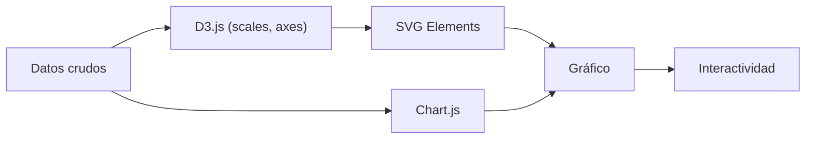

## 50 ÔÇö Data Visualization (Visualizaci├│n de Datos)

Visualizaci├│n de datos con D3.js, ngx-charts, y Chart.js en Angular para dashboards ejecutivos.

> **Propósito:** Visualizar datos en Angular con D3.js y Chart.js: gráficos interactivos (barras, líneas, pastel, dispersión), tooltips, animaciones y responsive.
>
> **Problema que resuelve:** Los datos sin visualización son difíciles de interpretar; las tablas de números no comunican tendencias, outliers ni distribuciones de manera efectiva.
>
> **Cómo lo resuelve:** D3.js para visualizaciones SVG personalizadas con escalas y ejes, Chart.js para gráficos comunes con configuración declarativa, responsive con ResizeObserver.
>
> **Por qu├® aprenderlo:** Data visualization es cr├¡tica en dashboards empresariales; D3.js + Angular permite gr├íficos personalizados con reactividad y rendimiento ├│ptimo.




### Conceptos Clave

- **ngx-charts**: `@swimlane/ngx-charts`, gráficos SVG, señales para datos
- **Chart.js**: `ng2-charts`, wrappers para Angular con se├▒ales y RxJS
- **D3.js**: selecciones, escalas, ejes, data join, transiciones
- **D3 + Angular**: `@ViewChild` para SVG container, se├▒ales reactivas
- **Gráficos**: barras, líneas, circular, radar, heatmap, sparklines
- **Interactividad**: tooltips, zoom, brush, hover states
- **Tiempo real**: datos streaming con D3 transitions y RxJS
- **Responsive**: SVG viewBox, ResizeObserver, se├▒ales de tama├▒o

### Proyecto

Dashboard ejecutivo con KPIs, gráficos de barras/líneas/circular, mapa de calor, y datos en tiempo real con D3.

### Ejercicios

1. Crea gráfico de barras con ngx-charts y señales
2. Crea gráfico de líneas con Chart.js y datos dinámicos
3. Implementa gráfico circular animado con D3
4. Conecta datos streaming (RxJS) a visualizaci├│n D3
5. Crea un KPI card animado con D3 transitions

### C├│mo ejecutar

```bash
cd 50-data-viz
npm install
ng serve --host 0.0.0.0 --port 8080
```
