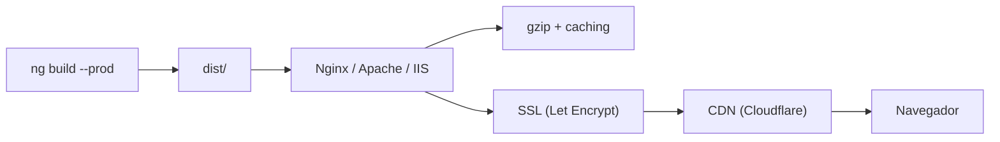

## 51 ÔÇö Full-Stack Angular + Express + FastAPI + Prisma

Aplicaci├│n full-stack con Angular + Express (Node) + FastAPI (Python), y Prisma ORM para base de datos.

> **Prop├│sito:** Desplegar Angular en producci├│n con servidores reales: Nginx, Apache, IIS, PM2, certificados SSL, CDN y optimizaci├│n de entrega de assets.
>
> **Problema que resuelve:** ng serve/build no considera configuraciones de servidor real (compresi├│n gzip, caching headers, SSL termination, CDN distribution, load balancing).
>
> **C├│mo lo resuelve:** Nginx con gzip, browser caching, SPA fallback, SSL con Let's Encrypt; PM2 para Node.js; configuraci├│n de CDN (Cloudflare/CloudFront); headers de seguridad y performance.
>
> **Por qu├® aprenderlo:** El deploy en producci├│n requiere conocimiento de infraestructura web que no se aprende en el desarrollo; esencial para ingenieros senior y arquitectos.




### Conceptos Clave

- **Tres backends**: mismo frontend Angular con 3 backends intercambiables
- **Express (Node)**: `express`, `prisma-client-js`, API REST, validaci├│n con Zod
- **FastAPI (Python)**: async, Pydantic models, Prisma Python, SQLAlchemy
- **Prisma ORM**: `schema.prisma`, migrations, `PrismaClient`, seed
- **API intercambiable**: misma interfaz REST, diferentes implementaciones
- **Variable de entorno**: `API_URL` para cambiar backend sin recompilar
- **Separaci├│n frontend/backend**: Angular en 4200, API en 3000/8000
- **Docker Compose**: full-stack con Angular + backend (a elegir) + PostgreSQL
- **CRUD completo**: Create, Read, Update, Delete con validaci├│n

### Proyecto

App de productos con 3 backends intercambiables (Express, FastAPI). CRUD, b├║squeda, paginaci├│n, y Docker Compose.

### Ejercicios

1. Modela datos con Prisma schema y ejecuta migraciones
2. Implementa API REST con Express + Prisma
3. Implementa la misma API con FastAPI + Prisma/SQLAlchemy
4. Configura `API_URL` dinámico en Angular
5. Crea Docker Compose full-stack

### C├│mo ejecutar

```bash
cd 51-server
# Con Express:
npm run dev:express
# Con FastAPI:
npm run dev:fastapi
```
