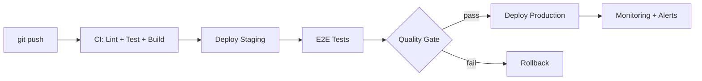

## 52 ÔÇö CI/CD Avanzado

Pipelines CI/CD avanzados con GitHub Actions: blue/green deployment, canary releases, multi-stage, y pruebas automatizadas.

> **Propósito:** Implementar pipelines CI/CD avanzados: GitHub Actions multi-stage, tests paralelos, lint + typecheck, deploy automático a múltiples entornos, rollback y approval gates.
>
> **Problema que resuelve:** Los deploys manuales son lentos, propensos a errores humanos e inconsistentes entre entornos; sin CI/CD no hay trazabilidad de qu├® se despleg├│ y cu├índo.
>
> **C├│mo lo resuelve:** GitHub Actions con jobs paralelos (lint, test, build), deploy progresivo devÔåÆstagingÔåÆproduction, approval gates manuales para producci├│n, rollback autom├ítico en fallo.
>
> **Por qu├® aprenderlo:** CI/CD avanzado es lo que distingue equipos maduros; permite deploys m├║ltiples por d├¡a con seguridad y trazabilidad completa.




### Conceptos Clave

- **GitHub Actions**: workflows multi-etapa, matrices, entornos
- **Multi-stage**: lint -> test -> build -> e2e -> deploy
- **Matrices**: probar en m├║ltiples versiones de Node/navegadores
- **Blue/Green**: dos entornos, switch de tráfico instantáneo
- **Canary releases**: % de tráfico a nueva versión, monitoreo
- **Entornos**: `environment` con reviewers, secrets, reglas de protecci├│n
- **Artefactos**: subir build como artefacto, reutilizar en deploy
- **Docker Registry**: build y push a Docker Hub / ghcr.io
- **Playwright en CI**: `npx playwright install`, `--shard` para paralelizar
- **Rollback**: reversión automática en fallo de health check

### Proyecto

Pipeline CI/CD completa: build -> test -> Docker build -> push -> deploy blue/green a VPS o cloud.

### Ejercicios

1. Crea workflow con lint, test, build, y e2e
2. Configura matriz de Node.js y navegadores
3. Implementa blue/green deployment con NGINX
4. Crea canary release con GitHub Actions
5. Configura rollback automático en health check

### C├│mo ejecutar

```bash
cd 52-ci-cd-avanzado
# Ver .github/workflows/ para los pipelines
# Deploy manual:
docker compose -f docker-compose.blue.yml up -d
```

### Archivos del Proyecto

| Archivo | Carpeta | Propósito |
|---------|---------|-----------|
| `README.md` | Raíz | Documentación del proyecto |
| `angular.json` | Raíz | Configuración del workspace Angular |
| `package.json` | Raíz | Dependencias y scripts del proyecto |
| `tsconfig.json` | Raíz | Configuración base de TypeScript |
| `tsconfig.app.json` | Raíz | Configuración de TypeScript para la app |
| `tsconfig.spec.json` | Raíz | Configuración de TypeScript para tests |
| `package-lock.json` | Raíz | Bloqueo de versiones de dependencias |
| `.github/workflows/ci.yml` | CI | Pipeline de integración continua (lint, test, build) |
| `.github/workflows/cd.yml` | CD | Pipeline de despliegue continuo (blue/green) |
| `deploy/deploy-staging.sh` | Deploy | Script de despliegue a staging |
| `deploy/deploy-production.sh` | Deploy | Script de despliegue a producción |
| `src/index.html` | `src/` | HTML principal de la aplicación |
| `src/main.ts` | `src/` | Punto de entrada de la aplicación |
| `src/styles.css` | `src/` | Estilos globales |
| `src/app/app.config.ts` | `src/app/` | Configuración de providers de Angular |
| `src/app/app.ts` | `src/app/` | Componente raíz de la aplicación |
| `src/app/app.routes.ts` | `src/app/` | Configuración de rutas |
