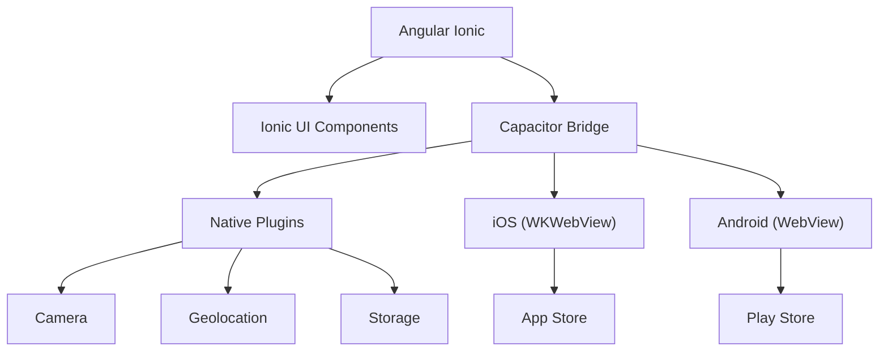

## 53 ÔÇö Ionic + Capacitor (Mobile con Angular)

Aplicaciones móviles con Angular usando Ionic + Capacitor: navegación, APIs nativas, cámara, GPS, y almacenamiento.

> **Propósito:** Desarrollar aplicaciones móviles nativas con Ionic + Capacitor + Angular: acceso a APIs nativas (cámara, GPS, notificaciones) y build para iOS/Android.
>
> **Problema que resuelve:** Desarrollar apps nativas separadas (Swift + Kotlin) duplica esfuerzo y requiere equipos especializados; las PWAs no acceden a todas las APIs nativas.
>
> **Cómo lo resuelve:** Ionic con componentes nativos iOS/Android, Capacitor plugins para cámara/GPS/notificaciones, y mismo código Angular para web + móvil con build nativo.
>
> **Por qu├® aprenderlo:** Ionic + Angular permite llegar a web, iOS y Android con el mismo c├│digo base; reducci├│n de costos del 60% vs equipos nativos separados.




### Conceptos Clave

- **Ionic**: `@ionic/angular`, componentes iOS/Android, `ion-tabs`, `ion-nav`
- **Capacitor**: `@capacitor/core`, plugins nativos (cámara, GPS, notificaciones)
- **Navegaci├│n**: `ion-router-outlet`, Angular Router integrado
- **Cámara**: `@capacitor/camera`, galería, permisos
- **GPS**: `@capacitor/geolocation`, mapas, seguimiento
- **Almacenamiento local**: `@capacitor/storage`, `@capacitor/preferences`
- **Push**: `@capacitor/push-notifications`, Firebase Cloud Messaging
- **Haptics**: `@capacitor/haptics`, feedback táctil
- **Build nativo**: Capacitor build, Android Studio/Xcode
- **PWA + Ionic**: modo web + app nativa desde mismo c├│digo

### Proyecto

App móvil con Ionic: login, lista con cámara, mapa con GPS, almacenamiento offline, y notificaciones push.

### Ejercicios

1. Crea proyecto Ionic con Angular
2. Implementa tabs de navegaci├│n
3. Integra cámara para tomar/fotos de galería
4. Muestra ubicaci├│n actual en mapa
5. Compila APK/IPA con Capacitor

### C├│mo ejecutar

```bash
cd 53-ionic
npm install
ionic serve
# Para nativo:
ionic build && npx cap open android
```

### Archivos del Proyecto

| Archivo | Carpeta | Propósito |
|---------|---------|-----------|
| `README.md` | Raíz | Documentación del proyecto |
| `angular.json` | Raíz | Configuración del workspace Angular |
| `package.json` | Raíz | Dependencias y scripts del proyecto |
| `tsconfig.json` | Raíz | Configuración base de TypeScript |
| `tsconfig.app.json` | Raíz | Configuración de TypeScript para la app |
| `tsconfig.spec.json` | Raíz | Configuración de TypeScript para tests |
| `package-lock.json` | Raíz | Bloqueo de versiones de dependencias |
| `capacitor.config.ts` | Raíz | Configuración de Capacitor para build nativo |
| `src/index.html` | `src/` | HTML principal de la aplicación |
| `src/main.ts` | `src/` | Punto de entrada de la aplicación |
| `src/styles.css` | `src/` | Estilos globales |
| `src/declarations.d.ts` | `src/` | Declaraciones de tipos para plugins nativos |
| `src/app/app.config.ts` | `src/app/` | Configuración de providers de Angular |
| `src/app/app.ts` | `src/app/` | Componente raíz Ionic |
| `src/app/app.routes.ts` | `src/app/` | Configuración de rutas con tabs |
| `src/app/home/home.ts` | `src/app/home/` | Pantalla principal de la app |
| `src/app/camera/camera.ts` | `src/app/camera/` | Componente de cámara con Capacitor plugin |
| `src/app/gps/gps.ts` | `src/app/gps/` | Componente de geolocalización con Capacitor |
