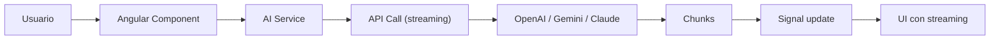

## 54 ÔÇö Integraci├│n con IA / LLMs

Integraci├│n de modelos de lenguaje (LLMs) en Angular: OpenAI, Claude, Gemini, streaming SSE, RAG, y prompt engineering.

> **Prop├│sito:** Integrar APIs de IA generativa con Angular: streaming de respuestas (Server-Sent Events), manejo de tokens, carga de documentos, y componentes de chat interactivos.
>
> **Problema que resuelve:** Las APIs de IA (OpenAI, Anthropic) son asíncronas, requieren manejo de streaming, tokens limitados y estado conversacional; integrarlas mal da UX pobre.
>
> **C├│mo lo resuelve:** SSE para streaming de respuestas con fetch + ReadableStream, manejo de tokens con contador, historial conversacional con signals, y componentes de chat tipados.
>
> **Por qu├® aprenderlo:** La IA generativa es la tecnolog├¡a m├ís transformadora del momento; integrarla en Angular abre posibilidades de productos inteligentes con chat, an├ílisis y automatizaci├│n.




### Conceptos Clave

- **LLM APIs**: OpenAI (`gpt-4o`), Claude (`claude-sonnet`), Gemini
- **Streaming SSE**: `EventSource`, fetch con `ReadableStream`, se├▒ales para chunks
- **RAG (Retrieval-Augmented Generation)**: búsqueda semántica + contexto
- **Embeddings**: `text-embedding-3-small`, vector search
- **Prompt Engineering**: system prompts, few-shot, templates
- **Backend proxy**: Express/FastAPI como proxy para LLM (protege API keys)
- **WebSocket streaming**: streaming via WebSocket para respuesta continua
- **Rate limiting**: control de tokens, límites por usuario
- **BFF para IA**: backend que orquesta RAG + LLM + contexto

### Proyecto

Chatbot IA con streaming, RAG sobre documentaci├│n, y selecci├│n de modelo. Backend proxy Express/FastAPI.

### Ejercicios

1. Crea chat con streaming SSE y se├▒ales
2. Implementa backend proxy Express para OpenAI
3. Añade RAG: embeddings + búsqueda semántica
4. Implementa selector de modelo (GPT-4o, Claude)
5. Agrega rate limiting por usuario

### C├│mo ejecutar

```bash
cd 54-ai-integration
npm install
npm run dev:all
```

### Archivos del Proyecto

| Archivo | Carpeta | Propósito |
|---------|---------|-----------|
| `README.md` | Raíz | Documentación del proyecto |
| `angular.json` | Raíz | Configuración del workspace Angular |
| `package.json` | Raíz | Dependencias y scripts del proyecto |
| `tsconfig.json` | Raíz | Configuración base de TypeScript |
| `tsconfig.app.json` | Raíz | Configuración de TypeScript para la app |
| `tsconfig.spec.json` | Raíz | Configuración de TypeScript para tests |
| `package-lock.json` | Raíz | Bloqueo de versiones de dependencias |
| `src/index.html` | `src/` | HTML principal de la aplicación |
| `src/main.ts` | `src/` | Punto de entrada de la aplicación |
| `src/styles.css` | `src/` | Estilos globales |
| `src/app/app.config.ts` | `src/app/` | Configuración de providers de Angular |
| `src/app/app.ts` | `src/app/` | Componente raíz de la aplicación |
| `src/app/app.routes.ts` | `src/app/` | Configuración de rutas |
| `src/app/ai.service.ts` | `src/app/` | Servicio de integración con API de IA |
| `src/app/chat.service.ts` | `src/app/` | Servicio de chat con streaming SSE |
| `src/app/chat.ts` | `src/app/` | Componente de chat interactivo con IA |
