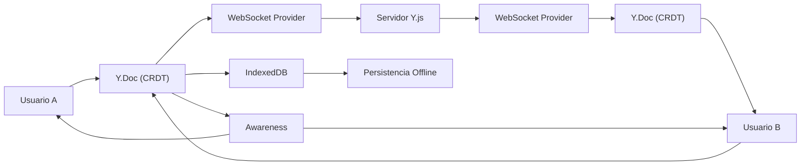

## 55 — Edición Colaborativa en Tiempo Real con Y.js

> **Propósito:** Implementar colaboración en tiempo real usando Y.js, un framework CRDT probado en producción (Google Docs, Figma, Notion). Aprenderás conceptos distribuidos avanzados como CRDT, Awareness, y persistencia offline.
>
> **Problema que resuelve:** La edición concurrente sin un sistema de resolución de conflictos resulta en datos corruptos. Implementar un CRDT desde cero es complejo y propenso a errores.
>
> **Cómo lo resuelve:** Y.js resuelve automáticamente los conflictos usando CRDTs optimizados. No necesitas manejar WebSocket/WebRTC manualmente, ni resolver conflictos, ni sincronizar cursores.
>
> **Por qué aprenderlo:** La colaboración en tiempo real es el nuevo estándar (Google Docs, Figma, Notion). Y.js es la librería CRDT más popular del ecosistema JavaScript, y entenderla te diferenciará como desarrollador.



### Conceptos Clave

- **Y.Doc**: El documento compartido. Es el "pizarrón mágico" donde todos escriben.
- **Y.Text**: Tipo de texto colaborativo. Es como una "cuerda mágica" que se sincroniza automáticamente.
- **CRDT**: Conflict-Free Replicated Data Type. Resuelve conflictos sin servidor central.
- **Provider**: Conecta tu documento con otros usuarios (WebSocket, WebRTC, etc.).
- **Awareness**: Sistema de presencia. Muestra quién está escribiendo dónde (cursores, selección).
- **Persistencia**: IndexedDB guarda el documento localmente para soporte offline.
- **Transacciones**: Operaciones atómicas que garantizan consistencia.

### Analogías

| Concepto | Analogía |
|----------|----------|
| Y.Doc | Pizarrón mágico donde todos pueden escribir al mismo tiempo |
| Y.Text | Línea de texto que se sincroniza automáticamente entre usuarios |
| Provider | Canal de comunicación que conecta tu pizarrón con otros |
| Awareness | Sistema de mensajería que notifica quién está escribiendo dónde |
| IndexedDB | Copia de seguridad local que persiste aunque no haya internet |
| Transacción | Caja fuerte que contiene todos los cambios de una vez |

### Archivos del Proyecto

| Archivo | Propósito |
|---------|-----------|
| `src/app/yjs.service.ts` | Servicio central de Y.js: crea el documento, providers, y maneja Awareness |
| `src/app/doc.service.ts` | Servicio de documento: usa Y.js para sincronizar el contenido |
| `src/app/collab.service.ts` | Servicio de colaboración: maneja la conexión con el servidor |
| `src/app/cursor.service.ts` | Servicio de cursores: usa Awareness para mostrar posiciones remotas |
| `src/app/editor.ts` | Componente editor: textarea colaborativo con cursores remotos |
| `src/app/app.ts` | Componente raíz: controles de conexión y editor |

### Cómo ejecutar

```bash
cd 55-real-time-collab
npm install
npm start
```

### Ejercicios

1. Conecta a un servidor Y.js público y prueba la sincronización
2. Agrega un campo de "nombre de usuario" que se muestre en Awareness
3. Implementa undo/redo usando `y-undo` plugin
4. Agrega soporte para formato rich text usando Quill + y-quill
5. Implementa presencia de audio/video usando WebRTC + Y.js

### Errores Frecuentes

| Error | Causa | Solución |
|-------|-------|----------|
| `Module not found: y-websocket` | No se instalaron las dependencias | `npm install yjs y-websocket y-indexeddb` |
| Cursores no aparecen | Awareness no está configurado | Verificar que `provider.awareness` esté inicializado |
| No sincroniza entre pestañas | IndexedDB no está configurado | Verificar que `IndexeddbPersistence` esté creado |
| Error de conexión WebSocket | URL del servidor incorrecta | Verificar la URL del servidor Y.js |

### Referencias

- [Y.js Documentation](https://docs.yjs.dev/)
- [y-websocket Provider](https://github.com/yjs/y-websocket)
- [y-indexeddb Persistence](https://github.com/yjs/y-indexeddb)
- [Y.js Examples](https://github.com/yjs/yjs-demos)
