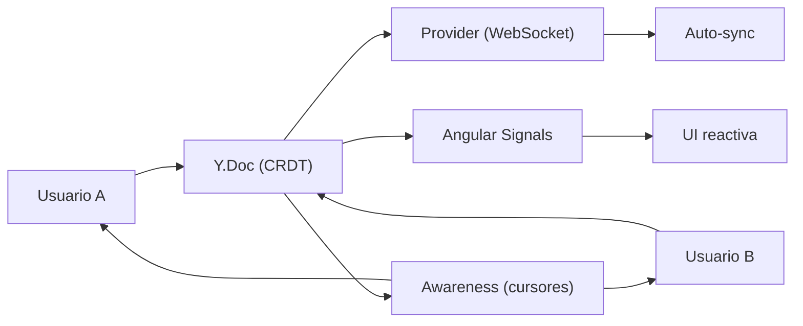

## 55 ÔÇö Edici├│n Colaborativa en Tiempo Real

Colaboraci├│n en tiempo real con Y.js, CRDTs, WebSocket y Angular. Edici├│n multi-usuario con awareness y cursores.

> **Prop├│sito:** Implementar colaboraci├│n en tiempo real con WebRTC y CRDT/Causal Trees: multiplayer cursors, edici├│n concurrente, conflict resolution y Operational Transform.
>
> **Problema que resuelve:** La edici├│n concurrente sin un sistema de resoluci├│n de conflictos resulta en datos corruptos; WebRTC es complejo de configurar (STUN/TURN, signaling, SDP exchange).
>
> **Cómo lo resuelve:** CRDT para resolución automática de conflictos sin servidor central, WebRTC con peer-to-peer via signaling serve --host 0.0.0.0 --port 8080r, Operational Transform para edición de texto colaborativa.
>
> **Por qu├® aprenderlo:** La colaboraci├│n en tiempo real es el nuevo est├índar (Google Docs, Figma, Notion); implementarla requiere conceptos distribuidos avanzados que pocos desarrolladores dominan.




### Conceptos Clave

- **Y.js**: CRDT (Conflict-Free Replicated Data Type), `Y.Doc`, `Y.Map`, `Y.Array`, `Y.Text`
- **CRDT**: resolución automática de conflictos sin servidor central
- **WebSocket provider**: `y-websocket`, sincronizaci├│n entre clientes
- **Awareness**: presencia, cursores, selecci├│n de otros usuarios
- **Angular + Y.js**: convertir `Y.Map` a se├▒ales con `toSignal`
- **Texto compartido**: `Y.Text` con `quill`/`prosemirror` binding
- **Undo/Redo**: `y-undo` plugin
- **Persistencia**: `y-indexeddb` para persistencia offline
- **Backend**: Node.js server con `y-websocket`, o FastAPI WebSocket

### Proyecto

Editor de documentos colaborativo multi-usuario con Y.js: edición simultánea, cursores en vivo, awareness, historial.

### Ejercicios

1. Configura Y.Doc con `y-websocket` provider
2. Convierte Y.Array a se├▒al Angular con `toSignal`
3. Implementa awareness (qui├®nes est├ín conectados)
4. Muestra cursores de otros usuarios en vivo
5. A├▒ade persistencia offline con IndexedDB

### C├│mo ejecutar

```bash
cd 55-real-time-collab
npm install
npm run dev:all
```

### Archivos del Proyecto

| Archivo | Carpeta | Propósito |
|---------|---------|-----------|
| `README.md` | Raíz | Documentación del proyecto |
| `angular.json` | Raíz | Configuración del workspace Angular |
| `package.json` | Raíz | Dependencias y scripts del proyecto |
| `tsconfig.json` | Raíz | Configuración base de TypeScript |
| `tsconfig.app.json` | Raíz | Configuración de TypeScript para la app |
| `tsconfig.spec.json` | Raíz | Configuración de TypeScript para tests |
| `package-lock.json` | Raíz | Bloqueo de versiones de dependencias |
| `src/index.html` | `src/` | HTML principal de la aplicación |
| `src/main.ts` | `src/` | Punto de entrada de la aplicación |
| `src/styles.css` | `src/` | Estilos globales |
| `src/app/app.config.ts` | `src/app/` | Configuración de providers de Angular |
| `src/app/app.ts` | `src/app/` | Componente raíz de la aplicación |
| `src/app/app.routes.ts` | `src/app/` | Configuración de rutas |
| `src/app/editor.ts` | `src/app/` | Editor colaborativo de documentos |
| `src/app/collab.service.ts` | `src/app/` | Servicio de colaboración con Y.js |
| `src/app/cursor.service.ts` | `src/app/` | Servicio de awareness y cursores multi-usuario |
| `src/app/doc.service.ts` | `src/app/` | Servicio de gestión de documentos compartidos |
