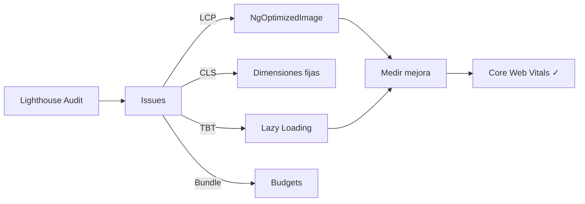

## 56 ÔÇö Rendimiento Avanzado

T├®cnicas avanzadas de rendimiento: `$effect` avanzado, `afterRender`, SSR streaming, ISR, hidrataci├│n parcial, y profiling.

> **Propósito:** Optimizar rendimiento Angular al máximo: bundle budgets, lazy loading avanzado, image optimization, Critical CSS, preconnect/preload, y Core Web Vitals perfectos.
>
> **Problema que resuelve:** Apps Angular pueden tener bundles grandes (>2MB), LCP lento (>4s) y CLS alto (>0.25) por imágenes sin dimensiones, lazy loading inadecuado y falta de optimización de assets.
>
> **Cómo lo resuelve:** Bundle budgets en angular.json, lazy loading por ruta y componente, ngOptimizedImage con lazy loading nativo y priorities, preconnect a orígenes críticos, y code splitting manual.
>
> **Por qu├® aprenderlo:** La performance impacta directamente en conversi├│n (1s m├ís = 7% menos conversiones) y SEO (Core Web Vitals son factor de ranking); es la habilidad m├ís valorada en seniors.




### Conceptos Clave

- **`effect()` avanzado**: cleanup, `allowSignalWrites`, efectos anidados
- **`afterRender()` / `afterNextRender()`**: hooks específicos del DOM
- **SSR Streaming**: renderizado progresivo, chunks, `@defer` en SSR
- **ISR (Incremental Static Regeneration)**: recarga de rutas prerenderedas
- **Hidrataci├│n parcial**: `provideClientHydration()` con partial hydration
- **Resource API**: `resource()` para peticiones asíncronas con señales
- **Virtual scrolling**: `@angular/cdk/scrolling`, `CdkVirtualScrollViewport`
- **Image optimization**: `NgOptimizedImage`, `loading="lazy"`, `srcset`
- **Profiling**: Chrome DevTools, Angular DevTools, `ng.profiler.timeChangeDetection`
- **Lighthouse**: auditoría, Core Web Vitals, opportunities

### Proyecto

Auditoría y optimización completa de rendimiento: profiling, ISR, virtual scrolling, imagenes, hidratación parcial.

### Ejercicios

1. Implementa `resource()` para carga de datos
2. Configura ISR para rutas dinámicas
3. Implementa virtual scrolling con CDK
4. Optimiza imágenes con `NgOptimizedImage`
5. Audita con Lighthouse y Angular DevTools, mejora LCP

### C├│mo ejecutar

```bash
cd 56-rendimiento-avanzado
npm install
ng serve --host 0.0.0.0 --port 8080
```

### Archivos del Proyecto

| Archivo | Carpeta | Propósito |
|---------|---------|-----------|
| `README.md` | Raíz | Documentación del proyecto |
| `angular.json` | Raíz | Configuración del workspace Angular |
| `package.json` | Raíz | Dependencias y scripts del proyecto |
| `tsconfig.json` | Raíz | Configuración base de TypeScript |
| `tsconfig.app.json` | Raíz | Configuración de TypeScript para la app |
| `tsconfig.spec.json` | Raíz | Configuración de TypeScript para tests |
| `package-lock.json` | Raíz | Bloqueo de versiones de dependencias |
| `src/index.html` | `src/` | HTML principal de la aplicación |
| `src/main.ts` | `src/` | Punto de entrada de la aplicación |
| `src/styles.css` | `src/` | Estilos globales |
| `src/app/app.config.ts` | `src/app/` | Configuración de providers de Angular |
| `src/app/app.ts` | `src/app/` | Componente raíz de la aplicación |
| `src/app/app.routes.ts` | `src/app/` | Configuración de rutas |
| `src/app/lazy-section.ts` | `src/app/` | Componente con lazy loading |
| `src/app/optimized-image.ts` | `src/app/` | Componente con NgOptimizedImage |
| `src/app/performance-metrics.ts` | `src/app/` | Componente de métricas de rendimiento |
| `src/app/virtual-scroll.ts` | `src/app/` | Componente con virtual scrolling (CDK) |
