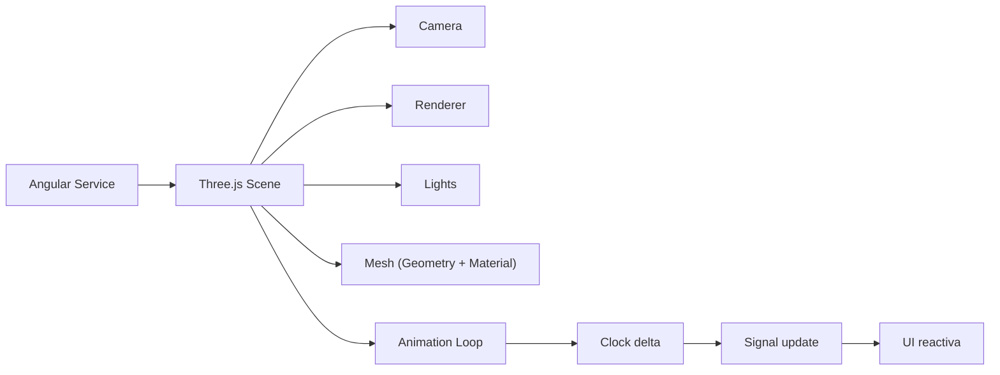

## 57 ÔÇö Three.js + Angular 3D

Gráficos 3D en Angular con Three.js: escenas, animaciones, partículas, y modelos 3D interactivos.

> **Propósito:** Integrar Three.js con Angular para visualización 3D interactiva: escenas, modelos, animaciones, controles de cámara y renderizado eficiente con Angular.
>
> **Problema que resuelve:** Las visualizaciones 3D en el navegador requieren WebGL, geometrías, materiales, luces y animaciones; implementarlo desde cero es extremadamente complejo.
>
> **Cómo lo resuelve:** Three.js abstrae WebGL con escenas, cámaras, renderers y geometrías; Angular wrap en servicios maneja el ciclo de vida del render loop y animaciones con requestAnimationFrame.
>
> **Por qu├® aprenderlo:** 3D en el navegador es cada vez m├ís demandado (configuradores de productos, dashboards 3D, simulaciones); Three.js es la librer├¡a 3D m├ís popular y su integraci├│n con Angular es directa via servicios.




### Conceptos Clave

- **Three.js**: `Scene`, `Camera`, `Renderer`, `Mesh`, `Geometry`, `Material`
- **Angular + Three.js**: directiva canvas, `@ViewChild` para renderer
- **Se├▒ales para 3D**: `signal<SceneState>`, `computed` para animaciones
- **Animaciones**: `requestAnimationFrame`, `Clock`, interpolaci├│n
- **Geometrías**: `BoxGeometry`, `SphereGeometry`, `TorusGeometry`, `BufferGeometry`
- **Materiales**: `MeshStandardMaterial`, `MeshPhongMaterial`, sombras
- **Luz**: `AmbientLight`, `DirectionalLight`, `PointLight`, `SpotLight`
- **Controles**: `OrbitControls`, `DragControls`, `TransformControls`
- **Carga de modelos**: GLTF/GLB loader, `useLoader`
- **Partículas**: `Points`, `PointsMaterial`, sistemas de partículas

### Proyecto

Visualizador 3D interactivo: modelos GLTF, iluminaci├│n, controles orbitales, animaciones, y paneles de control con se├▒ales.

### Ejercicios

1. Renderiza escena Three.js en un componente Angular
2. Añade geometrías con materiales y luces
3. Implementa animaci├│n loop con Clock
4. Carga un modelo GLTF externo
5. Crea un sistema de partículas animado

### C├│mo ejecutar

```bash
cd 57-threejs
npm install
ng serve --host 0.0.0.0 --port 8080
```

### Archivos del Proyecto

| Archivo | Carpeta | Propósito |
|---------|---------|-----------|
| `README.md` | Raíz | Documentación del proyecto |
| `angular.json` | Raíz | Configuración del workspace Angular |
| `package.json` | Raíz | Dependencias y scripts del proyecto |
| `tsconfig.json` | Raíz | Configuración base de TypeScript |
| `tsconfig.app.json` | Raíz | Configuración de TypeScript para la app |
| `tsconfig.spec.json` | Raíz | Configuración de TypeScript para tests |
| `package-lock.json` | Raíz | Bloqueo de versiones de dependencias |
| `src/index.html` | `src/` | HTML principal de la aplicación |
| `src/main.ts` | `src/` | Punto de entrada de la aplicación |
| `src/styles.css` | `src/` | Estilos globales |
| `src/app/app.config.ts` | `src/app/` | Configuración de providers de Angular |
| `src/app/app.ts` | `src/app/` | Componente raíz de la aplicación |
| `src/app/app.routes.ts` | `src/app/` | Configuración de rutas |
| `src/app/viewer.ts` | `src/app/` | Visor 3D principal con Three.js |
| `src/app/renderer.service.ts` | `src/app/` | Servicio de renderizado Three.js |
| `src/app/scene.service.ts` | `src/app/` | Servicio de gestión de escena 3D |
| `src/app/objects.service.ts` | `src/app/` | Servicio de creación y gestión de objetos 3D |
